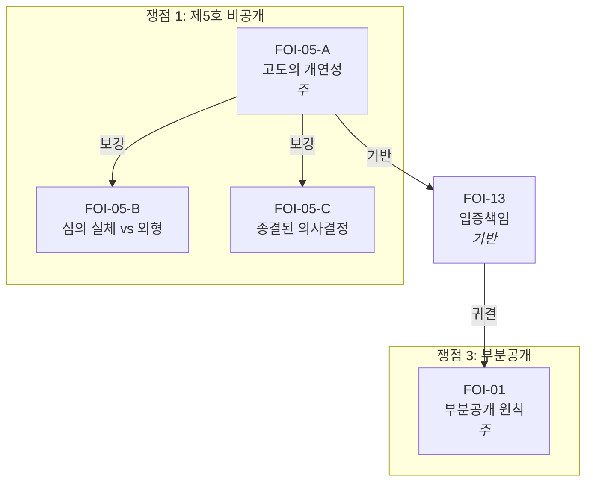

# 법률 문서 생성 하네스

## 사용법

사용자가 새로운 법률 문서 작성을 요청하면 다음 순서로 처리한다.

### 전체 적용 원칙

아래 원칙은 하네스의 **모든 단계**에 적용된다.

1. **서브에이전트 금지**: 하네스의 모든 단계에서 서브에이전트(Explore, Agent 등)를 사용하지 않는다. 판례·법령·사건 문서의 탐색과 읽기는 메인 에이전트가 직접 Read/Glob/Grep 도구로 수행한다.
2. **전문 전체 적재 원칙**: 모든 문서(판례, 법령, 사건 문서)를 읽을 때 snippet, 발췌, 부분 검색, regex 추출로 대체하지 않고 **전문 전체**를 Read 도구로 읽어 메인 컨텍스트 윈도우에 **직접 적재**한다. 긴 문서는 offset/limit을 나누어 여러 번에 걸쳐 읽되, 반드시 처음부터 끝까지 빠짐없이 전체를 읽는다. Grep으로 위치만 파악한 뒤 해당 줄 주변만 읽는 방식은 금지한다.
3. **목적**: 메인 에이전트의 컨텍스트 윈도우에 원문 전체가 적재되어야 구체적 사실관계와 뉘앙스를 정확히 파악하고, 이를 논증에 정밀하게 반영할 수 있다.

### 1단계: 참조 파일 읽기

다음 파일을 순서대로 읽는다:
1. `harness/09_문서_지도.md` — 디렉토리 전체 구조 및 사건별 문서 분류 (관련 문서를 빠짐없이 파악하기 위해 가장 먼저 읽는다)
2. `harness/06_생성_메타프롬프트.md` — 시스템 프롬프트 및 생성 절차
3. `harness/01_법리_데이터베이스.md` — 적용 가능한 법리 전체
4. `harness/02_판례_인용_사전.md` — 판례 인용 원문 (이것만 인용 가능)
5. `harness/02-1_법조문_인용_사전.md` — 법 조문 원문 (조문 인용 시 원문 대조)
6. `harness/03_문서_구조_템플릿.md` — 문서 유형별 구조
7. `harness/04_표현_사전.md` — 정형 표현 패턴
8. `harness/05_품질_기준_및_검증.md` — 생성 후 검증 체크리스트
9. `harness/07_논증_가이드라인.md` — 논증상 오류 예시 및 교정 방법

> **문서 지도 활용**: 09_문서_지도.md를 읽은 후, 해당 사건의 "관련 문서 참조 가이드" (4절)에 따라 사건 폴더 내 문서와 `법령_판례/` 폴더의 관련 법령·판례·내규를 모두 파악한다. PDF/HWP/DOCX 등 바이너리 문서를 직접 읽을 수 없을 때는 `python3 extract_all.py <파일경로>`를 Bash로 실행하여 추출된 텍스트를 읽는다.


### 2단계: 사건 문서 통독

09_문서_지도.md의 §4 "사건별 관련 문서 참조 가이드"에 따라, 해당 사건의 관련 문서를 **전부** 읽는다.

**읽기 대상**:
- 해당 사건 폴더의 **모든 절차 문서** (청구서, 결정통지서, 답변서, 청구이유서, 기존 보충서면 등)
- 해당 사건 폴더의 **모든 작성 문서** (별지, 법리보충, 요약본, 청구 본문 등)
- `법령_판례/판례/` 에서 참조 가이드가 지정한 판례 원문 (사실관계 파악용)
- `법령_판례/` 에서 참조 가이드가 지정한 법령·내규

**읽기 순서** (인과관계 역추적):
- 보충서면 작성 시: 답변서 → 청구이유서/청구서 → 원 정보공개청구서(별지, 법리보충, 요약본) → 결정통지서 → 민원(있는 경우) → 기존 보충서면(있는 경우)
- 청구이유서 작성 시: 결정통지서/처분 → 원 청구서(별지, 법리보충, 요약본)
- 이 순서로 읽어야 각 주장이 원 청구의 어느 부분에 대한 것인지, 처분이 청구의 어느 범위에 해당하는지를 정확히 파악할 수 있다.

**읽기 경로**:
- `.txt`, `.md` 파일은 Read 도구로 직접 읽는다.
- PDF, HWP, DOCX 등 바이너리 파일은 `python3 extract_all.py <파일경로>`를 Bash로 실행하여 stdout 출력을 읽는다.
- 판례 원문은 `법령_판례/판례/` 디렉토리의 PDF를 `extract_all.py`로 추출하여 읽는다.

**읽기 방식**:
- 전체 적용 원칙(전문 전체 적재 원칙, 서브에이전트 금지)을 따른다.
- 각 문서를 **전체** 읽는다. snippet, 부분 검색, regex 추출로 대체하지 않는다.
- 긴 문서는 페이지/라인 범위를 나누어 여러 번에 걸쳐 읽되, 전체를 빠짐없이 읽는다.
- **통독은 메인 에이전트가 직접 수행한다.** 발췌만 읽는 서브에이전트(Explore 등)에 위임하지 않는다. plan mode 등에서 서브에이전트 사용이 권장되더라도, 통독 단계만큼은 메인 컨텍스트에서 직접 전체를 읽는다.


### 2-1단계: 판례 전문 통독

2단계에서 사건 문서를 모두 읽은 뒤, 해당 사건에 적용할 판례를 선별하고 그 **전문**을 읽는다.

**적용 대상**: 문서에서 인용하려는 **모든** 판례 — 하네스 수록 여부를 불문한다.

**하네스 수록 판례** (`02_판례_인용_사전.md`에 있는 판례):
- 인용 사전의 요약·판시사항만으로는 부족하다. `법령_판례/판례/`에서 해당 판례 PDF를 `python3 extract_all.py`로 추출하여 **전체를 읽어** 구체적 사실관계와 판시 뉘앙스를 파악한다.

**하네스 미수록 판례** (`02_판례_인용_사전.md`에 없는 판례):
- `[미검증 판례]`로 바로 넘어가지 **않는다**.
- `법령_판례/판례/` 디렉토리에서 사건번호(예: `*2003두8050*`)로 Glob 검색하여 존재 여부를 확인한다.
- **존재하면**: `python3 extract_all.py`로 추출하여 전문을 읽고 사실관계·법리를 파악한 뒤 인용한다. `[미검증 판례]` 표시 불필요.
- **존재하지 않으면**: 인용하지 않는다.

**읽기 방식**:
- 전문 전체를 Read 도구로 직접 읽어 메인 컨텍스트 윈도우에 적재한다.
- snippet·발췌·부분 검색으로 대체 불가.
- 긴 판례는 offset/limit을 나누어 여러 번에 걸쳐 읽되, 처음부터 끝까지 빠짐없이 읽는다.
- 서브에이전트에 위임하지 않는다. 메인 에이전트가 직접 읽는다.


### 3단계: 사안 파악

2단계에서 읽은 문서를 바탕으로 다음 정보를 **직접 파악**한다. 파악할 수 없는 항목만 사용자에게 확인한다.

- **문서 유형**: 사용자 요청에서 확인
- **피청구기관**: 절차 문서에서 파악
- **사안 요약**: 절차 문서 전체에서 파악
- **청구 대상 정보** (정보공개의 경우): 청구서·별지에서 파악
- **예상 비공개 사유** (정보공개의 경우): 결정통지서에서 파악
- **처분 내용** (행정심판의 경우): 결정통지서에서 파악
- **답변서 주장** (보충서면의 경우): 답변서에서 **직접** 파악


### 4단계: 쟁점 정리 및 방향 제시

문서 생성에 앞서 다음을 정리하여 사용자에게 제시하고 확인을 받는다:

1. **사안의 경과 요약**: 원 청구 → 처분 → 행정심판 청구 → 답변서의 흐름을 간결하게 정리
2. **핵심 쟁점 목록**: 답변서(또는 처분사유)의 각 주장을 분석하여 쟁점별로 정리
3. **쟁점별 접근 방향**: 각 쟁점에 대해 어떤 법리·판례로 어떻게 반박/논증할지 개요
4. **문서 구성안**: 목차 수준의 구조 초안

사용자가 방향을 확인하거나 수정을 지시한 후에 4-1단계(법리 연결 그래프 설계)로 진행한다.

**`/goal` 자동 제안**: 4단계에서 문서 유형이 확정되면, 해당 유형의 `/goal` 템플릿을 사용자에게 제시한다. 사용자가 동의하면 `/goal`을 설정하여 매 턴 종료 시 독립 모델이 검증 조건 충족 여부를 확인하게 한다. `/goal`과 Layer 3 스크립트 트리거가 이중으로 작동하여 품질이 극대화된다.

> 예시 제안: "이 보충서면 작성에 다음 `/goal`을 설정하시겠습니까?"
> `/goal 문서에 em dash, '전혀', '불가능합니다'가 없고, 모든 판례 인용이 02_판례_인용_사전.md 수록분이거나 법령_판례/에 원문이 존재하며, 소극적 논증으로 끝나는 문단이 없고, 답변서의 각 주장에 대한 반박이 구체적 사실관계와 법리에 기반할 것`


### 4-1단계: 법리 연결 그래프 설계

4단계에서 확인된 쟁점에 대해, 적용할 법리를 `01_법리_데이터베이스.md`의 **코드명**(FOI-01, FOI-05-A, ADM-01 등)으로 호칭하며 논증 계획을 그래프로 구성한다.

그래프 파일은 두 부분으로 구성한다: (A) 스크립트가 파싱하는 **구조화 데이터**(JSON), (B) 사람이 한눈에 보는 **시각 다이어그램**(Mermaid).

**A. 구조화 데이터 (JSON)**

`validate_graph.py`가 자동으로 파싱하여 그래프-문서 정합성을 검증한다. 쟁점별 법리 코드·역할·판례·포섭을 기록한다.

```json
{
  "document": "보충서면_2026-10093",
  "issues": [
    {
      "id": 1,
      "title": "제5호 비공개 사유의 위법성",
      "doctrines": [
        {
          "code": "FOI-05-A",
          "role": "주",
          "cases": ["2009두19021", "2010두18758"],
          "subsumption": "추상적 사유만 제시, 항목별 구체적 판단 없음",
          "conclusion": "제5호 요건 미충족"
        },
        {
          "code": "FOI-05-B",
          "role": "보강",
          "parent": "FOI-05-A",
          "cases": ["2013두20301"],
          "subsumption": "청구 대상은 절차 외형 정보, 토의 내용과 구별"
        },
        {
          "code": "FOI-13",
          "role": "기반",
          "cases": ["2001두8827"],
          "subsumption": "비공개 입증은 피청구인 부담"
        }
      ]
    }
  ],
  "edges": [
    {"from": "FOI-05-A", "to": "FOI-05-B", "type": "보강"},
    {"from": "FOI-05-A", "to": "FOI-13", "type": "기반"},
    {"from": "FOI-13", "to": "FOI-01", "type": "귀결"}
  ]
}
```

**B. 시각 다이어그램 (Mermaid)**

법리 간 연결을 시각적으로 확인한다. 사용자에게 제시할 때 이 다이어그램을 사용한다.



**유의사항**:
- 모든 법리는 `01_법리_데이터베이스.md` 수록 코드명으로만 호칭한다
- 각 법리의 "연관 법리" 필드를 참고하되, 이 사건에 적합한 연결만 선택한다
- 답변서(보충서면) 또는 처분사유의 각 주장에 대응하는 법리가 빠짐없이 배치되었는지 확인한다
- 논증 순서: 처분성/적법 요건 → 본안(각 호별) → 절차적 하자 → 부분공개

**그래프 저장**: 그래프를 해당 사건 폴더에 `법리그래프_{문서명}.md` 파일로 저장한다. 예: `cases/02_대동제/법리그래프_보충서면_2026-10093.md`. 컨텍스트 압축 시에도 6단계 §15 검증에서 그래프를 참조할 수 있도록 하기 위함이다.


### 4-2단계: 그래프 검증 루프

4-1단계에서 생성한 그래프의 타당성을 검증한다. 미충족 항목이 1건이라도 있으면 그래프를 수정하고 전체를 재검증한다. 모든 항목이 충족될 때까지 반복한다.

검증은 두 단계로 수행한다: (A) 스크립트 자동 검증, (B) 모델 검증. (A)를 먼저 통과한 뒤 (B)로 진행한다.

**A. 스크립트 자동 검증**:

`python3 harness/scripts/validate_graph.py <project_dir> <doc_file> <graph_file>`을 실행한다 (doc_file이 아직 없는 경우 빈 파일 지정). 다음을 자동 탐지한다:
- 그래프 코드가 `01_법리_데이터베이스.md`에 미수록
- 각 쟁점에 주 법리(role: 주)가 없음
- JSON 파싱 오류

**B. 모델 검증 (5가지 기준)**:

아래 순서는 의존 관계를 반영한다. (1)이 통과해야 (2)~(3)의 판단이 가능하고, (1)~(3)이 확정되어야 (4)~(5)를 평가할 수 있다.

**(1) 쟁점-법리 대응 완전성** (선행 기준):
- 4단계에서 정리한 모든 쟁점에 주 법리가 배치되어 있는가
- 답변서(보충서면의 경우) 또는 처분사유의 각 주장에 대응하는 법리가 있는가
- 누락된 쟁점이 없는가

**(2) 법리 연결 정합성** (1 통과 후):
- 법리 간 연결이 논리적인가 (주 법리 → 보강 법리 → 기반 법리의 계층이 적절한가)
- `01_법리_데이터베이스.md`의 "연관 법리" 관계와 모순되지 않는가
- 불필요한 법리가 포함되지 않았는가 (이 사건에 적용이 어려운 법리)

**(3) 포섭 적합성** (1 통과 후):
- 각 법리의 소전제가 이 사건의 구체적 사실관계에 기반하는가
- 대전제에서 인용하려는 판례의 사실관계가 이 사건과 비교 가능한가
- 소전제가 사실관계를 과소·과대 서술하지 않는가 (→ `07_논증_가이드라인.md` §6)

**(4) 논증 순서 적정성** (1~3 확정 후):
- 처분성/적법 요건 쟁점이 본안보다 선행 배치되었는가
- 각 호 내에서 주 법리 → 보강 법리 순서인가
- 전체 논증의 흐름이 읽는 사람이 따라가기 쉬운 순서인가

**(5) 역이용 위험** (1~3 확정 후):
- 그래프에 배치된 논증 중 상대방이 역이용할 수 있는 구조가 없는가 (→ `07_논증_가이드라인.md` §3)
- 선행 공개 사실을 원용할 때 청구 실익 부정으로 이어질 위험이 없는가

**C. 내용 평가 (Stop hook 자동 트리거)**:

`validate_graph_content.py`가 Stop hook으로 턴 종료 시 자동 실행된다. 그래프 파일의 JSON과 `01_법리_데이터베이스.md`의 연관 법리·적용 사례 필드를 추출하여 독립 평가 프롬프트를 구성하고, exit 2로 모델 재진입을 유발한다. 재진입한 모델이 **그래프를 만든 맥락과 분리된 신선한 컨텍스트**에서 다음을 평가한다:

1. 각 쟁점의 주 법리가 핵심 논점에 가장 적합한가
2. 보강·기반 법리가 주 법리의 논증을 실질적으로 강화하는가
3. 포섭이 사실관계를 정확히 반영하며 과소·과대 서술이 없는가
4. 법리DB의 연관 법리 중 이 사건에 적용 가능하나 그래프에 누락된 것이 있는가
5. 적용 사례 필드의 선례와 비교하여 이 사건에서의 적용이 적절한가

평가 완료 후 그래프 파일의 검증 이력에 "내용 평가: pass" 또는 "내용 평가: fail → [수정 내용]"을 기록한다. "내용 평가: pass"가 기록되면 이후 턴에서 스크립트가 즉시 종료한다(토큰 소모 0).

**검증 기록**: 각 회차의 결과를 그래프 파일 말미의 `## 검증 이력` 섹션에 직접 기록한다. 컨텍스트 압축 후에도 검증 경과를 추적할 수 있게 하기 위함이다.

```
## 검증 이력

### 회차 1
- 스크립트(A): pass / fail → [수정 내용]
- (1) 완전성: pass / fail → [수정 내용]
- (2) 정합성: pass / fail → [수정 내용]
- (3) 포섭: pass / fail → [수정 내용]
- (4) 순서: pass / fail → [수정 내용]
- (5) 역이용: pass / fail → [수정 내용]
- 내용 평가(C): pass / fail → [수정 내용]
```

전 항목 충족 확인 후 사용자에게 Mermaid 다이어그램을 제시하고 확인을 받는다. 사용자가 수정을 지시하면 JSON과 Mermaid를 함께 수정한 뒤 재검증한다. 사용자가 확인한 후에 5단계(문서 생성)로 진행한다.


### 5단계: 문서 생성

4-2단계에서 확인된 법리 연결 그래프를 청사진으로 삼아 `06_생성_메타프롬프트.md`의 시스템 프롬프트에 따라 문서를 생성한다:
1. 사안 분석 (2~3단계에서 이미 완료)
2. 법리 선택 (4-1단계 그래프에서 이미 결정)
3. 논증 구성 (그래프의 포섭 요약을 상세 전개)
4. 문서 작성 (03 구조 + 04 표현)

**그래프 준수 원칙**:
- 그래프에 배치된 모든 법리가 문서에 반영되어야 한다
- 그래프에 없는 법리를 추가하지 않는다
- 논증 순서도 그래프의 배치를 따른다
- 문서 작성 중 그래프의 수정이 필요하다고 판단되면, 문서 작성을 중단하고 4-1단계로 돌아가 그래프를 수정한다

### 6단계: 3-Layer 반복 검증

`05_품질_기준_및_검증.md`의 3-Layer 검증 아키텍처에 따라 검증한다.

**Layer 1 — 패턴 검증 (자동)**:
`harness/scripts/validate_legal_doc.py`가 PostToolUse hook으로 Write/Edit 시 자동 실행된다. 금지 표현(em dash, "전혀", "불가능합니다", AI 도입부), 추정적 표현("대체로", "대략"), 비표준 용어("가림 처리", "재결례"), 편의적 번호, 문서 머리 콜론, 조문·판례 출처 혼동 패턴, 소극적 논증 패턴("제시하지 못하였습니다", "밝히지 않았습니다"로 끝나는 문단), 역이용 위험 패턴("이미 공개된"+"동일한 수준"), 청구 범위 자발적 제약 표현, 판례 용어 선행 인용 미검증 패턴("고도의 개연성" 등 판례 용어를 해당 판례 인용 전에 사용)을 탐지한다. stderr로 출력된 위반 사항을 모두 수정한 후 다음 단계로 진행한다.

**Layer 2 — 인용 정합성 검증 (자동)**:
`harness/scripts/validate_citations.py`가 Stop hook으로 턴 종료 시 자동 실행된다. 다음을 검증한다: (1) `02_판례_인용_사전.md` 미수록 판례 인용([미검증 판례] 표시 없이), (2) `02-1_법조문_인용_사전.md` 수록 법률의 미수록 조문 인용([미검증 조문] 표시 없이), (3) 재결 호수 형식(`재결 제YYYY-NNNNN호`), (4) 교차참조 번호 정합성. 불일치 시 exit code 2로 자기수정 루프가 작동한다: 불통과 이유가 다음 작업 지시가 되어 자동 수정 → 재검증. 8회 연속 block 시 자동 override.

**Layer 3 — 논증 품질 검증 (스크립트 트리거 + 모델 재진입)**:
두 단계로 작동한다.

(1) `harness/scripts/validate_layer3.py`가 Stop hook으로 턴 종료 시 자동 실행된다. 법률 문서가 아닌 턴에서는 즉시 종료(토큰 소모 0). 법률 문서 턴에서는 핵심 3종 + 그래프 정합성을 탐지한다: (a) 소극적 논증으로 끝나는 문단(문단 단위 검사), (b) IRAC 3단 구조 불완전(대전제만 있고 소전제/결론 누락), (c) 판례 인용 시 사실관계 비교 누락(정식 인용 후 15줄 이내에 비교 없음), (d) 그래프-문서 정합성(`validate_graph.py` 경유, 그래프 파일 존재 시): 코드 유효성, 판례 누락/미등록, 주 법리 미배치. 위반 발견 시 exit 2로 모델 재진입을 유발한다.

(2) 재진입 후, `05_품질_기준_및_검증.md`의 `[Layer 3 모델]` 태그 항목(§3 논증 완결성, §5 표현 적절성, §6 제외 선언, §7 선제적 방어, §8 부분공개 설계, §11 논증 충실성, §12 판례 인용 적정성, §13 조문·판례 출처 구별, §15 그래프-문서 정합성)을 순서대로 점검한다. **미충족 항목이 1건이라도 있으면** 해당 부분을 수정한 뒤, Layer 3 항목을 **처음부터 다시** 수행한다. 모든 항목이 충족될 때까지 이 과정을 반복하며, **반복 횟수에 상한을 두지 않는다**. Layer 1·2가 자동으로 처리하는 항목은 이 단계에서 건너뛴다.

각 회차에서 발견된 미충족 항목과 수정 내용을 다음 형식으로 기록하여, 같은 오류의 재발 여부를 추적한다:

```
[검증 회차 N]
- Layer 1: pass (자동) / fail → L47 AI_EM_DASH 수정
- Layer 2: pass (자동) / fail → 2022구합99999 인용 철회
- Layer 3: §11 소극적 논증 1건 ("~밝히지 않았다" L23) → 직접 논증으로 보강
- 회귀: 없음 / 이전 회차 수정 항목 재발 시 명시
```

최종 회차에서 전 항목 충족이 확인된 후에만 사용자에게 최종본을 제시한다.

**검증 이력 저장**: 문서 생성이 완료되면, 검증 이력을 해당 사건 폴더에 `검증이력_{문서명}.md` 파일로 저장한다. 예: `cases/02_대동제/검증이력_보충서면_2026-10093.md`. 이력 파일에는 전 회차의 검증 결과, 수정 내용, 회귀 여부를 기록하여, 동일 사건의 후속 문서 작성 시 반복 오류 패턴을 참조할 수 있게 한다.

**`/goal` 활용 (권장)**: 법률 문서 생성 세션에서 `/goal`로 핵심 검증 조건을 설정하면, 매 턴 종료 시 별도 소형 모델이 조건 충족 여부를 독립 확인한다. 문서 유형별 권장 `/goal` 템플릿:

- **보충서면**: `/goal 문서에 em dash, '전혀', '불가능합니다'가 없고, 모든 판례 인용이 02_판례_인용_사전.md 수록분이거나 법령_판례/에 원문이 존재하며, 소극적 논증('제시하지 못하였습니다', '밝히지 않았습니다')으로 끝나는 문단이 없고, 답변서의 각 주장에 대한 반박이 구체적 사실관계와 법리에 기반할 것`
- **청구이유서**: `/goal 문서에 em dash가 없고, 각 위법사항이 대전제-소전제-결론의 3단 구조를 갖추며, 판례 인용 시 사실관계 비교가 포함되고, 조문 용어와 판례 용어가 혼동 없이 구별될 것`
- **정보공개청구서 세트 (별지+법리보충+요약본)**: `/goal 각 청구 항목마다 제외 선언이 있고, 예상 비공개 사유별 선제적 방어가 포함되며, 부분공개 설계가 구체적이고, 요약본에 '별지 및 참고자료의 기재가 우선합니다' 문구가 포함될 것`
- **국민신문고 민원**: `/goal 톤이 정중하되 단호하고, 전제 선언으로 민원의 성격이 한정되며, 회신 요청이 항목별로 구체적이고, 마지막에 '조치 불가 시 근거와 사유' 요청이 포함될 것`

### 7단계: PDF 출력 (첨부 파일용 문서에 한함)

**PDF 직접 생성 대상**: 청구이유서, 보충서면, 별지, 법리보충 참고자료, 요약본
**텍스트만 생성 대상**: 국민신문고 민원, 정보공개청구서 본문, 행정심판청구서 본문, 이메일 (해당 플랫폼에 직접 입력)

PDF 생성 시 `harness/08_PDF_서식_사양.md`의 확정 사양을 적용한다:
- A4, 여백 좌우 25mm/상 25mm/하 15mm
- Noto Serif CJK KR: 본문 11pt, 소제목 13pt Bold, 대제목 18pt Bold
- 행간 2.0배, 페이지번호 `- N -` 하단 중앙

## 지원 문서 유형

| 유형 | 출력 형태 | 비고 |
|------|----------|------|
| 국민신문고 민원 | 텍스트 | epeople.go.kr에 입력 |
| 정보공개청구서 본문 | 텍스트 | open.go.kr에 입력 |
| 정보공개청구 별지 | **PDF** | 첨부 파일로 제출 |
| 법리보충 참고자료 | **PDF** | 첨부 파일로 제출 |
| 정보공개청구 요약본 | **PDF** | 첨부 파일로 제출 |
| 행정심판 청구이유서 | **PDF** | 첨부 파일로 제출 |
| 보충서면 | **PDF** | 첨부 파일로 제출 |

## 핵심 제약
- **판례 인용**: 모든 판례 인용 시 `법령_판례/판례/`에서 PDF를 찾아 `python3 extract_all.py`로 추출하여 반드시 전체를 읽는다. `02_판례_인용_사전.md` 미수록 판례는 `법령_판례/판례/`에서 존재 여부를 확인하고, 존재하면 추출하여 읽어 인용한다. 존재하지 않으면 인용하지 않는다.
- **법조문 인용**: `02-1_법조문_인용_사전.md`에 수록된 조문 원문과 대조. 미수록 조문 인용 시 `[미검증 조문]` 표시
- **표현**: `04_표현_사전.md`의 정형 패턴 준수
- **구조**: `03_문서_구조_템플릿.md`의 해당 유형 준수
- **PDF 서식**: `08_PDF_서식_사양.md`의 확정 사양 준수
- **하네스 유지보수**: harness/ 파일 수정 시 `harness/10_유지보수_가이드.md`의 절차를 따른다. 수정 후 `validate_harness_integrity.py`가 PostToolUse hook으로 자동 실행되어 정합성(수치·교차참조·용어·번호 순차성)을 검증한다.
