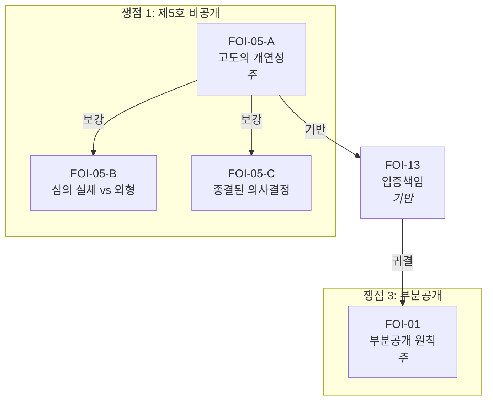

# 법률 문서 생성 하네스

## 전체 적용 원칙

아래 원칙은 하네스의 **모든 단계**에 적용된다.

1. **서브에이전트 제한**: 법률 문서 작성은 사건 전체의 사실관계, 쟁점 간 관계, 인용 판례의 뉘앙스가 하나의 컨텍스트 안에서 일관되게 유지되어야 한다. 서브에이전트는 이 맥락을 공유하지 못하므로, 탐색·읽기·생성은 메인 에이전트가 Read/Glob/Grep/Bash 도구로 직접 수행하는 것을 원칙으로 한다. **예외**: 7단계와 9단계의 Phase 2 내용 평가에 한하여 Agent 도구로 서브에이전트를 생성한다. 메인 에이전트의 확증 편향을 배제한 독립 평가를 위한 것이다.
2. **전문 전체 적재**: 법률 문서에서 판례·법령을 인용하려면 전문의 사실관계와 판시 뉘앙스를 파악해야 한다. 발췌나 검색 결과 주변만 읽으면 맥락을 놓쳐 오인용 위험이 있다. 판례·법령·사건 문서는 **전문 전체**를 메인 컨텍스트 윈도우에 직접 적재한다. 긴 문서는 offset/limit을 나누어 여러 번에 걸쳐 읽되, 처음부터 끝까지 빠짐없이 읽는다.
3. **파일 읽기 경로**: `.txt`/`.md` 파일은 Read 도구로 직접 읽는다. PDF/HWP/DOCX 등 바이너리 파일은 `python extract_all.py <파일경로>`를 Bash로 실행하여 stdout 출력을 읽는다.
4. **단계 순서 유지**: 각 단계는 이전 단계의 산출물을 전제로 설계되어 있다(예: 8단계 문서 생성은 6단계 법리 그래프를 청사진으로 삼고, 6단계는 2~3단계 통독에서 확보한 사실관계를 전제한다). 기존 작업물이 있더라도, 현 세션의 컨텍스트에 적재되지 않은 정보는 논증에 반영할 수 없으므로 각 단계를 처음부터 수행한다. 각 단계 완료 시 `진행로그_{문서명}.md`에 완료를 기록한다. 이 기록이 없으면 이후 단계의 파일 쓰기가 `validate_step_gate.py` 훅에 의해 차단된다.


## 절차

### 1단계: 참조 파일 읽기

다음 파일을 순서대로 읽는다:
1. `harness/디렉토리_지도.md` -- 디렉토리 구조 및 사건별 문서 분류
2. `harness/data/법리_데이터베이스.md` -- 적용 가능한 법리 전체
3. `harness/data/판례_인용_사전.md` -- 판례 인용 원문
4. `harness/data/법조문_인용_사전.md` -- 법 조문 원문
5. `harness/style/문서_구조_템플릿.md` -- 문서 유형별 구조
6. `harness/style/표현_사전.md` -- 정형 표현 패턴
7. `harness/style/논증_가이드라인.md` -- 논증 오류 예시 및 교정
8. `harness/quality/검증_체크리스트.md` -- 검증 체크리스트

디렉토리_지도.md를 읽은 후, 해당 사건의 "관련 문서 참조 가이드"에 따라 사건 폴더 내 문서와 `법령_판례/` 폴더의 관련 법령·판례·내규를 모두 파악한다.

**[체크포인트]** 해당 사건 폴더에 `진행로그_{문서명}.md`를 생성하고 "### 1단계 완료"와 읽은 harness 파일 목록을 기록한다.


### 2단계: 사건 문서 통독

디렉토리 지도의 관련 문서 참조 가이드에 따라 해당 사건의 관련 문서를 **전부** 읽는다.

**읽기 대상**:
- 해당 사건 폴더의 **모든 절차 문서** (청구서, 결정통지서, 답변서, 청구이유서, 기존 보충서면 등)
- 해당 사건 폴더의 **모든 작성 문서** (별지, 법리보충, 요약본, 청구 본문 등)
- `법령_판례/판례/`에서 참조 가이드가 지정한 판례 원문
- `법령_판례/`에서 참조 가이드가 지정한 법령·내규

**읽기 순서** (인과관계 역추적):
- 보충서면: 답변서 -> 청구이유서/청구서 -> 원 정보공개청구서(별지, 법리보충, 요약본) -> 결정통지서 -> 민원 -> 기존 보충서면
- 청구이유서: 결정통지서/처분 -> 원 청구서(별지, 법리보충, 요약본)

**[체크포인트]** `진행로그_{문서명}.md`에 "### 2단계 완료"와 통독한 문서 파일 목록을 기록한다. 기존 문서가 있더라도 3단계를 건너뛰지 않는다.


### 3단계: 판례 전문 통독

2단계 완료 후, 문서에서 인용하려는 **모든** 판례의 전문을 읽는다.

**하네스 수록 판례** (`data/판례_인용_사전.md`에 있는 판례):
- 인용 사전의 요약·판시사항만으로는 부족하다. `법령_판례/판례/`에서 해당 파일을 추출하여 전체를 읽고 구체적 사실관계와 판시 뉘앙스를 파악한다.

**하네스 미수록 판례** (`data/판례_인용_사전.md`에 없는 판례):
- `법령_판례/판례/`에서 사건번호(예: `*2003두8050*`)로 Glob 검색한다.
- **존재하면**: 추출하여 전문을 읽고 인용한다.
- **존재하지 않으면**: 인용하지 않는다.

**[체크포인트]** `진행로그_{문서명}.md`에 "### 3단계 완료"와 전문을 통독한 판례 사건번호 목록을 기록한다.


### 4단계: 사안 파악

2~3단계에서 읽은 문서를 바탕으로 다음을 **직접 파악**한다. 파악할 수 없는 항목만 사용자에게 확인한다.

- **문서 유형**: 사용자 요청에서 확인
- **피청구기관**: 절차 문서에서 파악
- **사안 요약**: 절차 문서 전체에서 파악
- **청구 대상 정보** (정보공개): 청구서·별지에서 파악
- **예상 비공개 사유** (정보공개): 결정통지서에서 파악
- **처분 내용** (행정심판): 결정통지서에서 파악
- **답변서 주장** (보충서면): 답변서에서 직접 파악

**[체크포인트]** `진행로그_{문서명}.md`에 "### 4단계 완료"와 파악한 사안 요약을 기록한다.


### 5단계: 쟁점 정리 및 방향 제시

문서 생성에 앞서 다음을 정리하여 사용자에게 제시하고 확인을 받는다:

1. **사안의 경과 요약**: 원 청구 -> 처분 -> 행정심판 청구 -> 답변서의 흐름
2. **핵심 쟁점 목록**: 답변서(또는 처분사유)의 각 주장을 쟁점별로 정리
3. **쟁점별 접근 방향**: 각 쟁점에 대해 어떤 법리·판례로 논증할지 개요
4. **문서 구성안**: 목차 수준의 구조 초안
5. **쟁점 간 논리적 관계**: 쟁점이 주위적·예비적 관계에 있으면 명시한다. 하나의 쟁점이 인용되면 다른 쟁점의 전제가 달라지는 구조(예: "비공개 대상이 아니다"와 "설령 비공개 대상이더라도 부분공개")가 있으면 그 관계를 밝혀, 문서에서 논리적 모순으로 읽히지 않도록 한다.
6. **채택하지 않은 쟁점**: 사안에서 다투기 가능하나 전략적으로 제외한 쟁점이 있으면 그 사유를 진행로그에 기록한다.

사용자 확인 후 6단계로 진행한다.

**[체크포인트]** 사용자 확인 후 `진행로그_{문서명}.md`에 "### 5단계 완료"와 확정된 쟁점 목록을 기록한다.


### 6단계: 법리 연결 그래프 설계

5단계에서 확인된 쟁점에 대해, `data/법리_데이터베이스.md`의 코드명(FOI-01, FOI-05-A, ADM-01 등)으로 법리를 호칭하며 논증 계획을 그래프로 구성한다. 그래프 파일은 (A) 구조화 데이터(JSON)와 (B) 시각 다이어그램(Mermaid) 두 부분으로 구성한다.

**A. 구조화 데이터 (JSON)**

`validate_graph.py`가 파싱하여 정합성을 검증한다.

```json
{
  "document": "보충서면_2026-10093",
  "issues": [
    {
      "id": 1,
      "title": "제5호 비공개 사유의 위법성",
      "doctrines": [
        {
          "code": "FOI-05-A",
          "role": "주",
          "cases": ["2009두19021", "2010두18758"],
          "subsumption": "추상적 사유만 제시, 항목별 구체적 판단 없음",
          "conclusion": "제5호 요건 미충족"
        },
        {
          "code": "FOI-05-B",
          "role": "보강",
          "parent": "FOI-05-A",
          "cases": ["2013두20301"],
          "subsumption": "청구 대상은 절차 외형 정보, 토의 내용과 구별"
        },
        {
          "code": "FOI-13",
          "role": "기반",
          "cases": ["2001두8827"],
          "subsumption": "비공개 입증은 피청구인 부담"
        }
      ]
    }
  ],
  "edges": [
    {"from": "FOI-05-A", "to": "FOI-05-B", "type": "보강"},
    {"from": "FOI-05-A", "to": "FOI-13", "type": "기반"},
    {"from": "FOI-13", "to": "FOI-01", "type": "귀결"}
  ]
}
```

**B. 시각 다이어그램 (Mermaid)**



**유의사항**:
- 법리는 `data/법리_데이터베이스.md` 수록 코드명으로만 호칭
- 각 법리의 "연관 법리"를 참고하되, 이 사건에 적합한 연결만 선택
- 답변서/처분사유의 각 주장에 대응하는 법리가 빠짐없이 배치되었는지 확인
- 논증 순서: 처분성/적법 요건 -> 본안(각 호별) -> 절차적 하자 -> 부분공개

**저장**: 해당 사건 폴더에 `법리그래프_{문서명}.md`로 저장한다. 컨텍스트 압축 후에도 9단계 그래프-문서 정합성 검증에서 그래프를 참조할 수 있도록 하기 위함이다.

**[체크포인트]** 그래프 저장 후 `진행로그_{문서명}.md`에 "### 6단계 완료"를 기록한다.


### 검증 루프 프레임워크

7단계와 9단계는 동일한 프레임워크를 따른다. 차이는 검증 대상, 실행 스크립트, 서브에이전트 평가 기준뿐이다.

```
대상 파일 Write/Edit
    |
Phase 1: PostToolUse 스크립트 자동 실행
    -> fail: 수정 후 재작성 (루프 처음으로)
    -> pass: Phase 2로
    |
Phase 2: 서브에이전트 내용 평가 (PostToolUse 자동 트리거)
    -> fail: 수정 후 재작성 (Phase 1부터 재검증)
    -> pass: 검증 완료
```

- **Phase 1** (스크립트 검증): PostToolUse hook이 자동 실행하는 검증 스크립트. 패턴 매칭, 구조 검증, 인용 정합성 등 규칙 기반 검증. 위반 시 exit 2로 차단.
- **Phase 2** (서브에이전트 내용 평가): Phase 1 전 스크립트가 통과한 후에만 트리거. 메인 에이전트의 확증 편향을 배제하기 위해 **Agent 도구로 서브에이전트를 생성**하여 독립 평가. 서브에이전트는 메인 대화 컨텍스트를 공유하지 않는다.
- **해시 기반 스킵**: pass 기록 시 대상 파일의 해시를 함께 기록한다. 파일이 변경되지 않았으면 Phase 2를 스킵한다(토큰 소모 0).
- **반복**: Phase 1 또는 Phase 2에서 1건이라도 실패하면 수정 후 재작성. PostToolUse hook이 재검증을 자동 트리거하므로 모든 검증이 만족될 때까지 반복된다. 횟수 상한 없음.

**검증 이력 형식** (회차별):

```
### 회차 N
- Phase 1 (스크립트): pass / [스크립트명] fail -> [수정 내용]
- Phase 2 (내용 평가): pass (hash: XXXXXXXXXXXX) / fail -> [수정 내용]
```


### 7단계: 그래프 검증 루프

검증 루프 프레임워크를 법리 그래프에 적용한다.

| 항목 | 설정 |
|------|------|
| **대상** | `법리그래프_{문서명}.md` |
| **Phase 1 스크립트** | `validate_graph.py` |
| **Phase 2 트리거** | `validate_graph_eval.py` (PostToolUse hook) |
| **검증 이력 위치** | 그래프 파일 말미 `## 검증 이력` |

**Phase 1 탐지 대상**: 미수록 법리 코드, 주 법리 미배치, JSON 파싱 오류, 그래프-문서 판례 불일치.

**Phase 2 서브에이전트 평가 기준**:

| 기준 | 점검 내용 |
|------|----------|
| 쟁점-법리 대응 완전성 | 5단계 모든 쟁점에 주 법리 배치. 답변서 각 주장에 대응 법리 존재 |
| 법리 선택 적합성 | 주 법리가 해당 쟁점의 핵심 논점에 가장 적합한가 |
| 법리 연결 정합성 | 주->보강->기반 계층 적절. 법리DB 연관 법리와 모순 없음 |
| 보강·기반 실질적 강화 | 보강·기반 법리가 주 법리를 실질적으로 강화하는가 |
| 포섭 적합성 | 사실관계 정확 반영. 과소·과대 서술 없음 |
| 논증 순서 | 처분성/적법->본안->절차->부분공개. 읽는 흐름 자연스러움 |
| 역이용 위험 | 상대방 역이용 가능 구조 없음 |
| 법리DB 누락 | 연관 법리 중 적용 가능하나 미포함 법리 존재 여부 |

전 항목 충족 확인 후 사용자에게 Mermaid 다이어그램을 제시하고 확인을 받는다. 수정 지시 시 JSON과 Mermaid를 함께 수정한 뒤 재검증한다(루프 재진입). 사용자 확인 후 8단계로 진행한다.

**[체크포인트]** 사용자 확인 후 `진행로그_{문서명}.md`에 "### 7단계 완료"를 기록한다.


### 8단계: 문서 생성

7단계에서 확인된 그래프를 청사진으로 삼아 문서를 생성한다.

**생성 절차**:
1. 사안 분석 (2~4단계에서 완료)
2. 법리 선택 (6단계 그래프에서 결정)
3. 논증 구성 (그래프 포섭 요약을 상세 전개, `style/논증_가이드라인.md` 참조)
4. 문서 작성 (`style/문서_구조_템플릿.md` + `style/표현_사전.md`)

**그래프 준수 원칙**:
- 그래프의 모든 법리가 문서에 반영되어야 한다. 9단계 검증에서 그래프-문서 정합성을 확인한다.
- 그래프에 없는 법리를 문서에 추가하면 검증 단계에서 불일치로 탐지된다. 추가가 필요하다고 판단되면 6단계로 돌아가 그래프를 먼저 수정하는 것을 원칙으로 한다.
- 논증 순서도 그래프를 따르는 것을 원칙으로 한다. 일관된 논증 흐름을 확보하기 위한 것이다.

#### 치환 변수

| 변수 | 설명 | 예시 |
|------|------|------|
| `{{사건번호}}` | 행정심판 사건번호 | 2026-00000 |
| `{{사건명}}` | 사건 유형 | 정보공개처분 행정심판 청구 |
| `{{청구인_성명}}` | 청구인 성명 | 홍길동 |
| `{{청구인_성명_자간벌림}}` | 청구인 성명 (자간 벌림) | 홍 길 동 |
| `{{피청구인}}` | 피청구인 표시 (기관명 + 직위) | OO대학교 총장 |

#### 생성 제약조건

1. 판례 인용 시 `data/판례_인용_사전.md`에 수록된 사건번호·선고일·판시사항 원문만 사용한다. 수록되지 않은 판례를 인용해야 하는 경우 "[미검증 판례]"로 표시한다. 하네스에 수록되지 않은 판례는 사건번호·선고일·판시사항의 정확성을 검증할 수 없으므로, 허위 인용 위험이 있다.
2. 법조항 인용 시 조·항·호·목·단서의 번호를 정확히 기재하고, `data/법조문_인용_사전.md`에 수록된 조문 원문과 대조한다. 수록되지 않은 조문을 인용해야 하는 경우 "[미검증 조문]"으로 표시한다.
3. 생성 완료 후 `quality/검증_체크리스트.md`의 체크리스트로 자기 검증하는 것을 원칙으로 한다. 9단계 검증 루프 이전에 기계적 오류를 사전에 걸러내어 검증 반복 횟수를 줄이는 효과가 있다.
4. `style/문서_구조_템플릿.md`는 각 유형의 기본 골격을 제공한다. 사안의 복잡도나 쟁점 구조에 따라 섹션을 추가·통합할 수 있으나, 번호 체계와 필수 섹션(청구취지, 결론 등)은 유지한다.
5. `style/표현_사전.md`의 정형 패턴을 활용한다. 법률 문서에서 일관된 전문 용어와 표현을 사용하면 문서의 전문성이 높아진다.
6. `style/논증_가이드라인.md`의 수정 전/수정 후 예시를 참조하여 동일한 논증 오류를 예방한다.
7. 소극적 논증("~을 밝히지 않았다")만으로 끝나면, 상대방이 뒤늦게 보충할 경우 논지 전체가 무력화된다. 왜 해당 요건이 충족되지 않는지를 사실관계와 법리로 직접 논증하는 것이 바람직하다 (상세 예시: 논증_가이드라인 §1).
8. 판례를 인용할 때는 해당 판결의 구체적 사실관계를 파악한 위에서, 이 사건의 사실관계와 비교하는 것을 원칙으로 한다. 사실관계가 상이한 판례를 인용하면 상대방의 사안 구별(distinguish) 반박에 노출된다 (상세 예시: 논증_가이드라인 §4).
9. 작성한 논지가 상대방의 반박 소재가 될 수 있는지 검토한다. 예컨대 "이미 공개된 정보와 동일한 수준"이라는 논지는 "청구 실익이 없다"는 반박을 초래할 수 있다 (상세 예시: 논증_가이드라인 §3).
10. 사건의 사실관계를 논증의 편의를 위하여 과소 또는 과대 서술하지 않는 것을 원칙으로 한다. 과소 서술은 스스로 청구 범위를 축소하는 격이 되고, 과대 서술은 상대방의 반박 대상이 된다 (상세 예시: 논증_가이드라인 §6).
11. 조문 용어와 판례 용어를 구별한다. "고도의 개연성", "비교교량" 등은 판례의 해석 기준이지 조문 문언이 아니다. 출처 없이 사용하면 부정확한 주장이 된다. 판례 용어를 사용할 때는 (가) 해당 판례를 먼저 인용한 뒤에 사용하고, (나) 주어를 판례로 명시한다("위 판결이 요구하는", "판례에 의하면"). 판례를 아직 인용하지 않은 맥락에서는 조문 문언을 사용한다 (상세 예시: 논증_가이드라인 §8).
12. 청구취지의 구제수단이 해당 절차에서 허용되는 구제범위와 정합하는지 검토한다. 절차가 허용하지 않는 구제를 청구취지에 포함하는 경우 병합 청구 등 절차적 근거를 갖추었는지 점검한다.
13. 해당 절차에서 고유하게 허용되는 심사범위나 판단 기준이 있으면 이를 활용할 수 있는지 검토한다. 위법 주장만으로 구성하기 전에, 해당 절차에서만 원용할 수 있는 별도의 심사 기준으로 예비적 주장이 가능한지 확인한다.
14. 청구 대상이 여러 항목·문서·정보로 구성된 경우, 항목마다 처분 사유의 적용 여부, 절차 단계, 분리 가능 부분이 다를 수 있다. 일반론 일괄 포섭은 개별 항목의 사정을 놓쳐 설득력이 떨어지므로, 각 항목의 개별 사정에 맞추어 법리를 적용하고 구체적으로 논증하는 것이 바람직하다.

#### 문서 유형별 생성 지침

**정보공개청구서 세트 (별지 + 법리보충 + 요약본)**:
- 생성 순서: 별지 -> 법리보충 -> 요약본
- 별지: 각 항목마다 "명시적으로 제외하는 부분"을 기재한다. 비공개 리스크를 사전에 차단하는 핵심 장치이다. "본 청구는 ~ 요구하는 것이 아닙니다"로 한계를 선언하면 피청구기관의 부존재 회신을 차단하는 데 유효하다. 문서 명칭 한정 불가 선언도 같은 맥락에서 포함하는 것이 바람직하다(명칭 불일치를 이유로 한 부존재 처리를 방지).
- 법리보충: 예상 비공개 사유에 대한 선제적 방어가 유효하다. "피청구기관이 ~ 원용할 가능성이 있음을 인식" -> "그러나 ~" 패턴을 사안에 맞게 활용한다. 인용 법령·판례 목록을 문서 말미에 일괄 정리한다.
- 요약본: 별지·법리보충의 핵심만 압축. "본 요약본과 별지·참고자료 사이에 해석상 차이가 있는 경우에는 별지 및 참고자료의 기재가 우선합니다" 문구를 포함한다. 요약 과정의 축약이 원본과 충돌할 때 해석 기준을 확보하기 위한 것이다.

**행정심판 청구이유서**:
- 각 위법사항: 법리(판례 인용) -> 사안 적용 -> "따라서 ~ 위법합니다" 결론
- 청구취지에서 취소 + 공개 의무를 함께 명시
- 처분성 쟁점이 있는 경우 맨 앞에 배치

**보충서면**:
- 피청구인 답변서의 주장 요지는 사건 폴더의 답변서를 직접 읽어 파악한다. 사용자에게 묻지 않는다.
- 답변서 주장을 정확히 인용 후 항목별 반박
- 피청구인의 자기 모순 지적 적극 활용
- 피청구인이 원용한 판례의 사안 구별(distinguish) 시도
- 상대방의 주장을 피상적으로 넘기지 않고, 그 주장의 구체적 내용·근거·인용 판례의 사실관계를 상세히 파악한 위에서 반박의 접근 방법을 설계하는 것이 바람직하다
- 상대방이 원용하지 않은 불리한 판례를 먼저 꺼내면 상대방에게 그 판례의 존재를 통보하는 격이 된다. 선제적 방어는 정보공개청구 단계(법리보충)에서 수행하고, 보충서면에서는 상대방이 실제로 원용한 것만 반박하는 것을 원칙으로 한다 (상세 예시: 논증_가이드라인 §5).
- 피청구인 주장 요지 서술 시 핵심 논리 위주로 간결하게 정리하는 것이 바람직하다. 상대방이 인용한 판례·규정을 일일이 나열하면 쟁점이 흐려진다.

**국민신문고 민원**:
- 톤: 정중하되 단호
- 전제 선언으로 민원의 성격 한정
- 회신 요청은 구체적 항목별로, 마지막에 "조치 불가 시 근거와 사유"


### 9단계: 문서 검증 루프

검증 루프 프레임워크를 법률 문서에 적용한다.

| 항목 | 설정 |
|------|------|
| **대상** | `cases/*/작성_최종/`·`작성_초안/`의 `.txt`/`.typ` 중 하네스 생성물(대응 진행로그·검증이력을 보유). `절차_*`·`증거`·`민원`·`분석`·`법적분석`·`외부소통`·`피청구인_증거`·`archive`의 수신·원본 자료는 검증 대상이 아니다 |
| **Phase 1 스크립트** | `validate_doc.py` |
| **Phase 2 트리거** | `validate_doc_eval.py` (PostToolUse hook) -> Agent 서브에이전트 |
| **검증 이력 위치** | `검증이력_{문서명}.md` |

**Phase 1 탐지 대상** (단일 스크립트, 기계적 형식 검증만):

em dash, AI 도입부 표현, 절대적·과장적 표현, 공격적 표현, 비표준 용어, 편의적 번호, 문서 머리 콜론, 미수록 판례/조문 인용, 재결 형식.

**Phase 2 서브에이전트 평가 기준**: `quality/검증_체크리스트.md`의 `[Phase 2]` 태그가 붙은 항목 전체이다. `validate_doc_eval.py`가 체크리스트를 직접 파싱하여 서브에이전트 평가 프롬프트를 구성하므로, 평가 기준의 정본은 `검증_체크리스트.md` 하나이다. 항목을 추가·수정하려면 체크리스트만 고치면 되며, 본 SKILL에는 중복 표를 두지 않는다(중복 시 드리프트 방지).

최종 회차에서 전 항목 충족 후에만 최종본을 제시한다.


### 10단계: PDF 출력

**PDF 생성 대상**: 청구이유서, 보충서면, 별지, 법리보충 참고자료, 요약본
**텍스트만 생성**: 국민신문고 민원, 정보공개청구서 본문, 행정심판청구서 본문, 이메일

PDF 생성 시 `quality/PDF_서식.md`의 확정 사양을 적용한다:
- A4, 여백 좌우 25mm / 상 25mm / 하 15mm
- Noto Serif CJK KR: 본문 11pt, 소제목 13pt Bold, 대제목 18pt Bold
- 행간 2.0배, 페이지번호 `- N -` 하단 중앙


### 11단계: 정리 및 보관

모든 산출물 생성이 완료되면 작업 파일을 정리한다.

**1. 산출물 배치 확인**

생성된 최종 문서가 `작성_최종/`에 있는지 확인한다:
- PDF 파일 (별지, 법리보충, 요약본, 청구이유서, 보충서면)
- 텍스트 파일 (행정심판청구서 본문, 정보공개청구서 본문, 민원 본문 등)

`작성_최종/` 밖에 있으면 이동한다. `작성_최종/`이 없으면 생성한다.

**2. 임시 로그 파일 보관**

사건 폴더 루트의 하네스 생성 파일을 `archive/`로 이동한다:
- `진행로그_{문서명}.md`
- `법리그래프_{문서명}.md`
- `검증이력_{문서명}.md` (존재하는 경우)

`archive/` 디렉토리가 없으면 생성한다.

**3. 정리 결과 보고**

다음을 사용자에게 보고한다:
- `작성_최종/`에 배치된 산출물 목록
- `archive/`로 이동한 로그 파일 목록

**[체크포인트]** `진행로그_{문서명}.md`에 "### 11단계 완료"와 정리 결과(산출물 경로, 보관 파일 목록)를 기록한 후 `archive/`로 이동한다.


## 지원 문서 유형

| 유형 | 출력 형태 | 비고 |
|------|----------|------|
| 국민신문고 민원 | 텍스트 | epeople.go.kr 입력 |
| 정보공개청구서 본문 | 텍스트 | open.go.kr 입력 |
| 정보공개청구 별지 | **PDF** | 첨부 제출 |
| 법리보충 참고자료 | **PDF** | 첨부 제출 |
| 정보공개청구 요약본 | **PDF** | 첨부 제출 |
| 행정심판 청구이유서 | **PDF** | 첨부 제출 |
| 보충서면 | **PDF** | 첨부 제출 |


## 제약 요약

- **판례 인용**: 3단계 절차를 따른다
- **법조문 인용**: `data/법조문_인용_사전.md` 수록 조문과 대조. 미수록 시 `[미검증 조문]` 표시
- **표현**: `style/표현_사전.md` 정형 패턴 활용
- **구조**: `style/문서_구조_템플릿.md` 해당 유형의 기본 골격 활용
- **PDF 서식**: `quality/PDF_서식.md` 확정 사양 적용
- **하네스 관리**: 판례 추가, case 추가/수정 시 `harness/관리_절차.md`의 절차를 따른다
