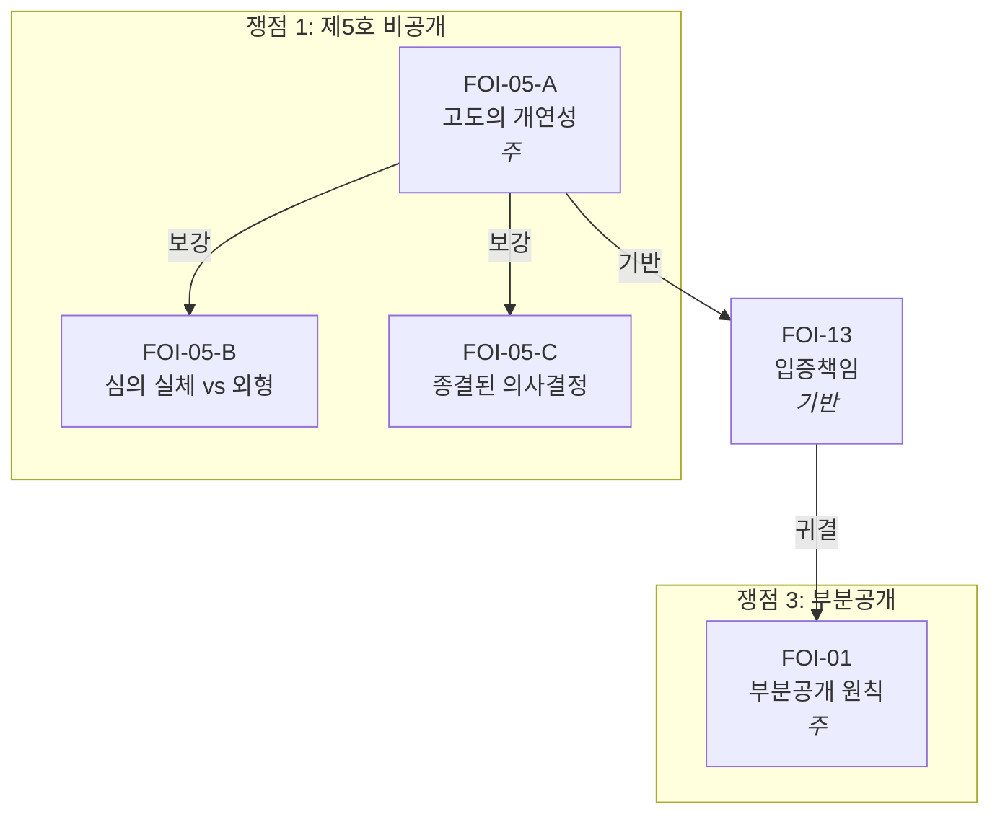

# 법률 문서 생성 하네스

## 전체 적용 원칙

아래 원칙은 하네스의 **모든 단계**에 적용된다.

1. **서브에이전트 금지**: 서브에이전트(Explore, Agent 등)를 사용하지 않는다. 모든 탐색·읽기·생성을 메인 에이전트가 Read/Glob/Grep/Bash 도구로 직접 수행한다.
2. **전문 전체 적재**: 판례·법령·사건 문서를 읽을 때 snippet, 발췌, 부분 검색, regex 추출로 대체하지 않는다. **전문 전체**를 메인 컨텍스트 윈도우에 직접 적재한다. 긴 문서는 offset/limit을 나누어 여러 번에 걸쳐 읽되, 처음부터 끝까지 빠짐없이 읽는다. Grep으로 위치만 파악한 뒤 해당 줄 주변만 읽는 방식은 금지한다. 원문 전체가 컨텍스트에 있어야 사실관계와 뉘앙스를 정확히 파악하고 논증에 반영할 수 있다.
3. **파일 읽기 경로**: `.txt`/`.md` 파일은 Read 도구로 직접 읽는다. PDF/HWP/DOCX 등 바이너리 파일은 `python3 extract_all.py <파일경로>`를 Bash로 실행하여 stdout 출력을 읽는다.


## 절차

### 1단계: 참조 파일 읽기

다음 파일을 순서대로 읽는다:
1. `harness/09_문서_지도.md` — 디렉토리 구조 및 사건별 문서 분류
2. `harness/06_생성_메타프롬프트.md` — 시스템 프롬프트 및 생성 절차
3. `harness/01_법리_데이터베이스.md` — 적용 가능한 법리 전체
4. `harness/02_판례_인용_사전.md` — 판례 인용 원문
5. `harness/02-1_법조문_인용_사전.md` — 법 조문 원문
6. `harness/03_문서_구조_템플릿.md` — 문서 유형별 구조
7. `harness/04_표현_사전.md` — 정형 표현 패턴
8. `harness/05_품질_기준_및_검증.md` — 검증 체크리스트
9. `harness/07_논증_가이드라인.md` — 논증 오류 예시 및 교정

09_문서_지도.md를 읽은 후, 해당 사건의 §4 "관련 문서 참조 가이드"에 따라 사건 폴더 내 문서와 `법령_판례/` 폴더의 관련 법령·판례·내규를 모두 파악한다.


### 2단계: 사건 문서 통독

문서 지도의 §4에 따라 해당 사건의 관련 문서를 **전부** 읽는다.

**읽기 대상**:
- 해당 사건 폴더의 **모든 절차 문서** (청구서, 결정통지서, 답변서, 청구이유서, 기존 보충서면 등)
- 해당 사건 폴더의 **모든 작성 문서** (별지, 법리보충, 요약본, 청구 본문 등)
- `법령_판례/판례/`에서 참조 가이드가 지정한 판례 원문
- `법령_판례/`에서 참조 가이드가 지정한 법령·내규

**읽기 순서** (인과관계 역추적):
- 보충서면: 답변서 → 청구이유서/청구서 → 원 정보공개청구서(별지, 법리보충, 요약본) → 결정통지서 → 민원 → 기존 보충서면
- 청구이유서: 결정통지서/처분 → 원 청구서(별지, 법리보충, 요약본)


### 3단계: 판례 전문 통독

2단계 완료 후, 문서에서 인용하려는 **모든** 판례의 전문을 읽는다.

**하네스 수록 판례** (`02_판례_인용_사전.md`에 있는 판례):
- 인용 사전의 요약·판시사항만으로는 부족하다. `법령_판례/판례/`에서 해당 PDF를 추출하여 전체를 읽고 구체적 사실관계와 판시 뉘앙스를 파악한다.

**하네스 미수록 판례** (`02_판례_인용_사전.md`에 없는 판례):
- `법령_판례/판례/`에서 사건번호(예: `*2003두8050*`)로 Glob 검색한다.
- **존재하면**: 추출하여 전문을 읽고 인용한다.
- **존재하지 않으면**: 인용하지 않는다.


### 4단계: 사안 파악

2~3단계에서 읽은 문서를 바탕으로 다음을 **직접 파악**한다. 파악할 수 없는 항목만 사용자에게 확인한다.

- **문서 유형**: 사용자 요청에서 확인
- **피청구기관**: 절차 문서에서 파악
- **사안 요약**: 절차 문서 전체에서 파악
- **청구 대상 정보** (정보공개): 청구서·별지에서 파악
- **예상 비공개 사유** (정보공개): 결정통지서에서 파악
- **처분 내용** (행정심판): 결정통지서에서 파악
- **답변서 주장** (보충서면): 답변서에서 직접 파악


### 5단계: 쟁점 정리 및 방향 제시

문서 생성에 앞서 다음을 정리하여 사용자에게 제시하고 확인을 받는다:

1. **사안의 경과 요약**: 원 청구 → 처분 → 행정심판 청구 → 답변서의 흐름
2. **핵심 쟁점 목록**: 답변서(또는 처분사유)의 각 주장을 쟁점별로 정리
3. **쟁점별 접근 방향**: 각 쟁점에 대해 어떤 법리·판례로 논증할지 개요
4. **문서 구성안**: 목차 수준의 구조 초안

사용자 확인 후 6단계로 진행한다.

**`/goal` 자동 제안**: 문서 유형이 확정되면 아래 템플릿을 사용자에게 제시한다. 동의 시 `/goal`을 설정하여 매 턴 종료 시 독립 모델이 검증 조건을 확인한다. `/goal`과 Layer 3 스크립트 트리거가 이중으로 작동하여 품질이 극대화된다.

| 문서 유형 | `/goal` 템플릿 |
|----------|--------------|
| 보충서면 | em dash·'전혀'·'불가능합니다' 없음, 모든 판례가 인용사전 수록 또는 `법령_판례/`에 원문 존재, 소극적 논증 종결 문단 없음, 답변서 각 주장에 대한 구체적 반박 |
| 청구이유서 | em dash 없음, 각 위법사항이 대전제-소전제-결론 3단 구조, 판례 인용 시 사실관계 비교 포함, 조문·판례 용어 구별 |
| 청구서 세트 (별지+법리보충+요약본) | 항목별 제외 선언, 비공개 사유별 선제적 방어, 구체적 부분공개 설계, 요약본에 '별지 및 참고자료의 기재가 우선합니다' |
| 국민신문고 민원 | 정중·단호 톤, 전제 선언으로 성격 한정, 항목별 구체적 회신 요청, '조치 불가 시 근거와 사유' 요청 |


### 6단계: 법리 연결 그래프 설계

5단계에서 확인된 쟁점에 대해, `01_법리_데이터베이스.md`의 코드명(FOI-01, FOI-05-A, ADM-01 등)으로 법리를 호칭하며 논증 계획을 그래프로 구성한다. 그래프 파일은 (A) 구조화 데이터(JSON)와 (B) 시각 다이어그램(Mermaid) 두 부분으로 구성한다.

**A. 구조화 데이터 (JSON)**

`validate_graph.py`가 파싱하여 정합성을 검증한다.

```json
{
  "document": "보충서면_2026-10093",
  "issues": [
    {
      "id": 1,
      "title": "제5호 비공개 사유의 위법성",
      "doctrines": [
        {
          "code": "FOI-05-A",
          "role": "주",
          "cases": ["2009두19021", "2010두18758"],
          "subsumption": "추상적 사유만 제시, 항목별 구체적 판단 없음",
          "conclusion": "제5호 요건 미충족"
        },
        {
          "code": "FOI-05-B",
          "role": "보강",
          "parent": "FOI-05-A",
          "cases": ["2013두20301"],
          "subsumption": "청구 대상은 절차 외형 정보, 토의 내용과 구별"
        },
        {
          "code": "FOI-13",
          "role": "기반",
          "cases": ["2001두8827"],
          "subsumption": "비공개 입증은 피청구인 부담"
        }
      ]
    }
  ],
  "edges": [
    {"from": "FOI-05-A", "to": "FOI-05-B", "type": "보강"},
    {"from": "FOI-05-A", "to": "FOI-13", "type": "기반"},
    {"from": "FOI-13", "to": "FOI-01", "type": "귀결"}
  ]
}
```

**B. 시각 다이어그램 (Mermaid)**



**유의사항**:
- 법리는 `01_법리_데이터베이스.md` 수록 코드명으로만 호칭
- 각 법리의 "연관 법리"를 참고하되, 이 사건에 적합한 연결만 선택
- 답변서/처분사유의 각 주장에 대응하는 법리가 빠짐없이 배치되었는지 확인
- 논증 순서: 처분성/적법 요건 → 본안(각 호별) → 절차적 하자 → 부분공개

**저장**: 해당 사건 폴더에 `법리그래프_{문서명}.md`로 저장한다. 컨텍스트 압축 후에도 9단계 §15 검증에서 그래프를 참조할 수 있도록 하기 위함이다.


### 7단계: 그래프 검증 루프

6단계 그래프의 타당성을 검증한다. 미충족 항목이 1건이라도 있으면 수정 후 전체를 재검증한다. 모든 항목 충족까지 반복한다.

검증은 A → B → C 순서로 수행한다.

**A. 스크립트 자동 검증**

`python3 harness/scripts/validate_graph.py <project_dir> <doc_file> <graph_file>`을 실행한다 (doc_file이 아직 없으면 빈 파일 지정). 탐지 대상: 미수록 법리 코드, 주 법리 미배치, JSON 파싱 오류.

**B. 모델 검증 (5가지 기준)**

순서는 의존 관계를 반영한다. (1) 통과 후 (2)~(3)이 가능하고, (1)~(3) 확정 후 (4)~(5)를 평가한다.

| 기준 | 선행 조건 | 점검 내용 |
|------|---------|----------|
| **(1) 쟁점-법리 대응 완전성** | - | 5단계의 모든 쟁점에 주 법리 배치. 답변서/처분사유 각 주장에 대응 법리 존재. 누락 쟁점 없음 |
| **(2) 법리 연결 정합성** | (1) | 주→보강→기반 계층 적절. 법리DB "연관 법리"와 모순 없음. 불필요한 법리 미포함 |
| **(3) 포섭 적합성** | (1) | 소전제가 구체적 사실관계에 기반. 인용 판례 사실관계 비교 가능. 과소·과대 서술 없음 (→ `07_논증_가이드라인.md` §6) |
| **(4) 논증 순서 적정성** | (1)~(3) | 처분성/적법→본안→절차→부분공개 순서. 각 호 내 주→보강 순서. 읽는 흐름 자연스러움 |
| **(5) 역이용 위험** | (1)~(3) | 상대방 역이용 가능 구조 없음 (→ `07_논증_가이드라인.md` §3). 선행 공개 원용→청구 실익 부정 위험 없음 |

**C. 내용 평가 (자동 트리거)**

`validate_graph_content.py`가 PostToolUse hook으로 `법리그래프_*.md` Write/Edit 직후 자동 실행된다. 그래프 JSON과 법리DB의 연관 법리·적용 사례를 추출하여 독립 평가 프롬프트를 구성하고, exit 2로 모델 재진입을 유발한다. 재진입한 모델이 그래프를 만든 맥락과 분리된 컨텍스트에서 다음을 평가한다:
1. 주 법리가 핵심 논점에 가장 적합한가
2. 보강·기반 법리가 실질적으로 강화하는가
3. 포섭이 사실관계를 정확히 반영하는가
4. 법리DB 연관 법리 중 누락이 있는가
5. 적용 사례 선례와 비교하여 적절한가

"내용 평가: pass" 기록 후에는 이후 턴에서 즉시 종료(토큰 소모 0).

**검증 기록**: 각 회차 결과를 그래프 파일 말미 `## 검증 이력`에 기록한다.

```
## 검증 이력

### 회차 1
- 스크립트(A): pass / fail → [수정 내용]
- (1) 완전성: pass / fail → [수정 내용]
- (2) 정합성: pass / fail → [수정 내용]
- (3) 포섭: pass / fail → [수정 내용]
- (4) 순서: pass / fail → [수정 내용]
- (5) 역이용: pass / fail → [수정 내용]
- 내용 평가(C): pass / fail → [수정 내용]
```

전 항목 충족 확인 후 사용자에게 Mermaid 다이어그램을 제시하고 확인을 받는다. 수정 지시 시 JSON과 Mermaid를 함께 수정한 뒤 재검증한다. 사용자 확인 후 8단계로 진행한다.


### 8단계: 문서 생성

7단계에서 확인된 그래프를 청사진으로 삼아 `06_생성_메타프롬프트.md`의 시스템 프롬프트에 따라 문서를 생성한다:
1. 사안 분석 (2~4단계에서 완료)
2. 법리 선택 (6단계 그래프에서 결정)
3. 논증 구성 (그래프 포섭 요약을 상세 전개)
4. 문서 작성 (`03_문서_구조_템플릿.md` + `04_표현_사전.md`)

**그래프 준수 원칙**:
- 그래프의 모든 법리가 문서에 반영되어야 한다
- 그래프에 없는 법리를 추가하지 않는다
- 논증 순서도 그래프를 따른다
- 그래프 수정이 필요하면 문서 작성을 중단하고 6단계로 돌아간다


### 9단계: 3-Layer 반복 검증

`05_품질_기준_및_검증.md`의 3-Layer 검증 아키텍처에 따라 검증한다. Layer 1·2는 PostToolUse hook으로 자동 실행되며, Layer 3은 스크립트 트리거 후 모델이 직접 점검한다.

**Layer 1 - 패턴 검증 (자동)**: `validate_legal_doc.py`가 Write/Edit 시 자동 실행. 금지 표현, 추정적 표현, 비표준 용어, 소극적 논증 패턴, 역이용 위험 패턴 등을 탐지한다. 위반 사항을 모두 수정한 후 진행한다.

**Layer 2 - 인용 정합성 (자동)**: `validate_citations.py`가 `cases/*.txt` Write/Edit 시 자동 실행. 미수록 판례/조문 인용, 재결 호수 형식, 교차참조 정합성을 검증한다. 위반 시 exit 2로 자기수정 루프가 작동한다(8회 연속 block 시 자동 override).

**Layer 3 - 논증 품질 (스크립트 트리거 + 모델 점검)**:
1. `validate_layer3.py`가 `cases/*.txt` Write/Edit 시 자동 실행. 소극적 논증 종결, IRAC 불완전, 판례 인용 시 사실관계 비교 누락, 그래프-문서 정합성을 탐지하고 exit 2로 모델 재진입을 유발한다.
2. 재진입 후 `05_품질_기준_및_검증.md`의 `[Layer 3 모델]` 태그 항목(§3, §5, §6, §7, §8, §11, §12, §13, §15)을 순서대로 점검한다. 미충족 항목이 1건이라도 있으면 수정 후 Layer 3을 처음부터 재수행한다. 반복 횟수 상한 없음. Layer 1·2가 자동 처리하는 항목은 건너뛴다.

**검증 이력 기록**:

```
[검증 회차 N]
- Layer 1: pass / fail → [수정 내용]
- Layer 2: pass / fail → [수정 내용]
- Layer 3: [항목] [위반 내용] → [수정 내용]
- 회귀: 없음 / 재발 시 명시
```

최종 회차에서 전 항목 충족 후에만 최종본을 제시한다. 검증 이력은 해당 사건 폴더에 `검증이력_{문서명}.md`로 저장한다.


### 10단계: PDF 출력

**PDF 생성 대상**: 청구이유서, 보충서면, 별지, 법리보충 참고자료, 요약본
**텍스트만 생성**: 국민신문고 민원, 정보공개청구서 본문, 행정심판청구서 본문, 이메일

PDF 생성 시 `harness/08_PDF_서식_사양.md`의 확정 사양을 적용한다:
- A4, 여백 좌우 25mm / 상 25mm / 하 15mm
- Noto Serif CJK KR: 본문 11pt, 소제목 13pt Bold, 대제목 18pt Bold
- 행간 2.0배, 페이지번호 `- N -` 하단 중앙


## 지원 문서 유형

| 유형 | 출력 형태 | 비고 |
|------|----------|------|
| 국민신문고 민원 | 텍스트 | epeople.go.kr 입력 |
| 정보공개청구서 본문 | 텍스트 | open.go.kr 입력 |
| 정보공개청구 별지 | **PDF** | 첨부 제출 |
| 법리보충 참고자료 | **PDF** | 첨부 제출 |
| 정보공개청구 요약본 | **PDF** | 첨부 제출 |
| 행정심판 청구이유서 | **PDF** | 첨부 제출 |
| 보충서면 | **PDF** | 첨부 제출 |


## 제약 요약

- **판례 인용**: 3단계 절차를 따른다
- **법조문 인용**: `02-1_법조문_인용_사전.md` 수록 조문과 대조. 미수록 시 `[미검증 조문]` 표시
- **표현**: `04_표현_사전.md` 정형 패턴 준수
- **구조**: `03_문서_구조_템플릿.md` 해당 유형 준수
- **PDF 서식**: `08_PDF_서식_사양.md` 확정 사양 준수
- **하네스 유지보수**: harness/ 수정 시 `10_유지보수_가이드.md` 절차를 따른다. `validate_harness_integrity.py`가 PostToolUse hook으로 자동 검증한다.
