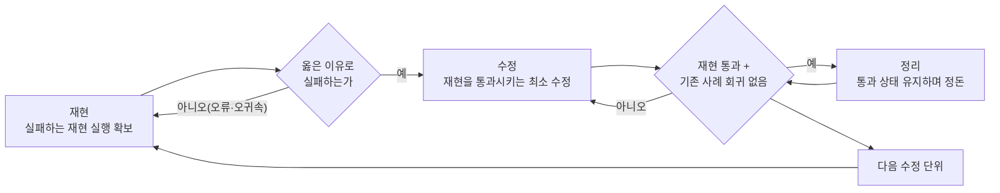

# 재현 우선 코드 수정 (TDD 로컬판)

수정 전에 실패하는 재현 실행을 확보한다. 실패를 직접 관찰한다. 그 재현을 통과시키는 최소한만 고친다.

**핵심 원리: 실패를 직접 보지 않았으면, 그 검증이 옳은 것을 검증하는지 알 수 없다.** 통과만 본 검증은 아무것도 검증하지 않았을 수 있다(exit 0은 정합의 증명이 아니다).

**규칙의 문면을 어기는 것이 곧 규칙의 정신을 어기는 것이다.** "정신만 지키면 된다"는 생각은 이 절차가 봉쇄하려는 합리화의 입구다.

## 원본 추적

- 원본: claude-plugins-official / superpowers / 6.1.0 / test-driven-development
- 원본 경로: `~/.claude/plugins/cache/claude-plugins-official/superpowers/6.1.0/skills/test-driven-development/`
- 원본 SKILL.md 해시: `60d2609ca56c7177a98f462fb71af77844ce92af` (동반 리소스 testing-anti-patterns.md 해시 `e77ab6b6d65ecfb0d8212a32186bf68d18b5eade`, 커스텀본에는 미포함하고 "대역의 4원리" 절로 압축 흡수)
- 각색 일자: 2026-07-02 (adapt-skill로 생성)
- 대조한 로컬 정본: settings.json, CLAUDE.md, legal-harness·memory-harness·extract-documents·casenote-fetch SKILL.md, 검증_체크리스트.md, 세칙 v14, L-0001, L-0005
- 대조표: `references/원본_대조.md` (지시 단위 24행, 독립 반증 검증 반영)
- 재검토 트리거: 원본 플러그인 갱신(해시 불일치), 로컬 규범 개정(특히 테스트 인프라 도입, mock 프레임워크 도입 시 원본 리소스 재검토), adapt-skill 재호출로 수행

## 적용 범위

**코드 산출 작업에 적용한다**: 신규 기능, 버그 수정, 리팩토링, 동작 변경 등(예시이며 이에 한정하지 않는다). 이 프로젝트의 코드는 `harness/scripts/` 7종, `extract_all.py`, `.claude/skills/casenote-fetch/scripts/fetch_casenote.py`, `legal-workbench/` 등이다.

**적용하지 않는 것**: 법률 문서·메모리 노드·하네스 참조 문서 등 산문 산출물. 그 품질 게이트는 `legal-harness`의 검증 루프(Phase 1 기계 검증 + Phase 2 독립 서브에이전트)가 정본이다. 이 스킬을 산문에 적용하려 하고 있다면 관할을 잘못 잡은 것이다.

**이 프로젝트 특유의 선행·후행 게이트**: 코드의 다수가 `harness/scripts/`에 있는데, `harness/`는 불변 자산이다(`.claude/CLAUDE.md`). 수정 착수 전에 사용자 확인을 받는다. 변경 후에는, harness의 데이터·문서에 닿는 변경이면 `python harness/scripts/validate_harness.py` exit 0이 커밋 전 정본 요구이고(관리_절차 4절), 코드만 바꿨어도 문서의 기술(예: SKILL의 동작 설명)과 어긋날 수 있으면 보수적으로 실행한다(정본 문언을 넘어서는 확장 관례다).

**예외 (사용자에게 확인)**: 버리는 일회성 스크래치 스크립트, 생성된 코드, 설정 파일 등. "이번만 건너뛰자"는 생각이 들면 멈춘다. 그것은 예외 사유가 아니라 합리화다. 예외는 자기 판단이 아니라 사용자 승인으로만 열린다.

## 철칙

```
실패하는 재현 실행 없이 수정 코드를 확정하지 않는다
```

재현을 확보하기 전에 수정 코드를 먼저 썼다면, 그 수정분은 버리고 재현부터 다시 시작한다.

**예외 없음:**
- "참조용으로 보관"하지 않는다
- 재현을 만들면서 그 수정분을 "각색"하지 않는다
- 들여다보지도 않는다
- 버린다는 것은 버린다는 것이다

재현에서 새로 구현한다. 이유: 먼저 쓴 수정분을 남겨 두면 재현·검증이 그 수정에 맞춰 사후 구성되고(자기기만), "이미 쓴 것이 아깝다"는 매몰비용이 판단을 오염시킨다. 버리는 비용이 신뢰할 수 없는 코드를 유지하는 비용보다 싸다.

## 재현-수정-정리 사이클



### 재현: 실패하는 재현 실행 확보

하나의 동작을 보이는 최소 재현 사례를 확보한다: 실제 입력(실제 PDF, 실제 호출 인자)과 그것을 스크립트에 넣는 실행 한 줄.

**요건:**
- 동작 하나(재현이 여러 동작을 겹쳐 보이면 실패의 귀속이 흐려진다)
- 무엇을 재현하는지 이름·기록이 분명할 것
- 실물 입력 우선(대역은 실물로 불가능한 부분에만)

### 재현 검증: 실패를 직접 관찰

**필수. 건너뛰지 않는다.**

재현 실행(python 스크립트 직접 호출 등)으로 실패를 눈으로 확인한다:

- 실패한다(오류로 죽는 것이 아니라, 고치려는 그 동작이 잘못됨을 보인다)
- 실패 양상이 예상과 일치한다
- 실패 이유가 고치려는 결함이다(오타·환경 문제가 아니라)

**재현이 이미 통과하면?** 고칠 것이 재현되지 않은 것이다. 재현부터 다시 구성한다.

**재현이 오류로 죽으면?** 오류를 고치고, 옳은 이유로 실패할 때까지 재실행한다.

### 수정: 최소한만

재현을 통과시키는 가장 단순한 수정을 한다.

재현 범위 밖의 기능 추가, 다른 코드의 리팩토링, "하는 김에 개선"을 하지 않는다. 이유: 검증되지 않는 변경이 섞이면 어느 변경이 무엇을 바꿨는지 추적할 수 없게 된다. 요청받은 개선이 실측상 파괴적이면 최소 수정만 적용하고 기각 사유를 보고한다(M-0026에서 "부실 감지 추가" 요청이 실측 진단으로 기각된 것이 로컬 실증이다).

### 수정 검증: 통과와 회귀를 직접 관찰

**필수.**

- 재현 사례가 통과한다
- 기존 정상 사례를 재실행해 회귀가 없다(수정이 다른 것을 깨지 않았다)
- 출력에 예상 밖의 오류·경고가 없다(이 프로젝트 도구는 정상 동작에서도 stderr에 진행 로그를 내므로, 정상 진행 로그는 제외하고 본다)
- harness 데이터·문서에 닿는 변경이면 `validate_harness.py` exit 0(적용 범위 절 참조)

**재현이 실패하면?** 코드를 고친다. 재현을 고치지 않는다(검증 기준을 산출물에 맞추는 것은 검증의 포기다).

**기존 사례가 깨지면?** 지금 고친다.

### 정리: 통과 상태에서만

재현·회귀 통과 후에만: 중복 제거, 이름 개선, 정돈. 통과 상태를 유지하고, 동작을 추가하지 않는다. 정리 대상이 `harness/`면 불변 자산 게이트(적용 범위 절)가 먼저다.

### 반복

다음 수정 단위마다 이 사이클을 처음부터 반복한다.

## 좋은 재현 사례

| 기준 | 좋음 | 나쁨 |
|------|------|------|
| **최소** | 동작 하나. 설명에 "그리고"가 들어가면 쪼갠다 | 여러 결함을 한 재현에 겹침 |
| **명확** | 기록만 봐도 무엇을 재현하는지 안다 | "버그 재현1" |
| **의도 표시** | 원하는 동작이 무엇인지 드러난다 | 현재 동작을 그대로 박제 |

재현 사례는 "무엇이 되어야 하는가"를 먼저 적게 만드는 장치이기도 하다. 원하는 동작을 먼저 정의하지 않으면 수정이 목표 없이 표류한다.

## 왜 순서가 중요한가

**"수정하고 나서 확인하면 되잖아"**

수정 후에 만든 검증은 즉시 통과한다. 즉시 통과하는 검증은 아무것도 증명하지 않는다: 엉뚱한 것을 보고 있을 수 있고, 결함이 아니라 구현을 확인하고 있을 수 있고, 잊어버린 경계 사례는 영영 확인되지 않는다. 실패를 먼저 봐야 그 검증이 실제로 무언가를 검증함이 증명된다.

**"손으로 이미 다 확인해 봤다"**

임기응변 확인은 기록이 없고, 무엇을 확인했는지 재구성할 수 없다. 재현 입력을 확정해 두면 같은 확인을 같은 방식으로 다시 실행할 수 있다. 이 프로젝트에는 상주 테스트 스위트가 없으므로 자동 재실행까지는 못 가지만, 재현 입력을 기록(커밋 메시지·메모리 노드)해 두면 다음 수정 때 재실행할 수 있다. 기록 없는 수동 확인은 그것도 불가능하다.

**"몇 시간 쓴 코드를 지우는 건 낭비다"**

매몰비용 오류다. 그 시간은 이미 갔다. 지금의 선택지는 (a) 버리고 재현부터 다시(시간이 더 들지만 신뢰 확보), (b) 남겨 두고 사후 확인(빠르지만 신뢰 없음, 결함 잔존 개연성). 진짜 낭비는 신뢰할 수 없는 코드를 유지하는 것이다.

**"재현 먼저는 교조적이다. 실용적으로 가자"**

재현 우선이 실용이다. 결함을 커밋 전에 잡는 것이 배포 후 디버깅보다 빠르고, 재현 기록이 남아 다음 수정 때 회귀를 잡을 수 있고, 재현 사례가 코드의 사용법을 문서화한다. "실용적" 지름길은 나중의 디버깅으로 갚는다.

**"이 프로젝트엔 테스트 스위트가 없으니 TDD가 불가능하다"**

이 스킬이 요구하는 것은 스위트가 아니라 재현이다. 스크립트를 실제 입력으로 직접 실행하는 것은 언제나 가능하다. 스위트 부재는 "자동 상주 회귀망이 없다"는 한계일 뿐 "실패를 먼저 관찰한다"는 원리의 면제 사유가 아니다. 실제로 이 프로젝트의 모범 수정(M-0026)이 정확히 이 절차로 수행됐다.

## 흔한 합리화

| 합리화 | 실제 |
|--------|------|
| "너무 단순해서 확인이 필요 없다" | 단순한 코드도 깨진다. 재현 실행은 1분이면 된다 |
| "수정하고 나서 확인하겠다" | 사후 검증의 즉시 통과는 아무것도 증명하지 않는다 |
| "사후 확인도 같은 목적을 달성한다" | 사후는 "이게 뭘 하나"를 확인하고, 선행은 "뭘 해야 하나"를 확인한다. 다른 것이다 |
| "손으로 이미 확인했다" | 기록 없는 임기응변은 재실행할 수 없다 |
| "몇 시간 쓴 걸 지우다니" | 매몰비용 오류. 신뢰 없는 코드의 유지가 진짜 부채다 |
| "참조용으로 남기고 재현부터 쓰겠다" | 결국 그것을 각색하게 된다. 그것이 사후 확인이다. 버린다 |
| "먼저 탐색해 봐야 알겠다" | 좋다. 탐색은 버리고, 재현부터 다시 시작한다 |
| "재현을 만들기 어렵다면 설계가 불분명한 것" | 재현이 어려우면 코드 구조를 의심한다 |
| "재현 먼저는 느리다" | 배포 후 디버깅보다 빠르다 |
| "스위트가 없으니 불가능하다" | 재현 실행은 스위트 없이 항상 가능하다 |
| "테스트 인프라가 생기면 그때 하겠다" | 지금 재현 실행으로 지킬 수 있는 원리를 미래 인프라로 미루는 합리화다 |

## 중단 신호

다음 생각이 들면 멈추고 재현부터 다시 시작한다:

- 재현 전에 코드부터 쓰고 있다
- 수정 후에 재현을 만들고 있다
- 재현이 즉시 통과했다
- 왜 실패했는지 설명할 수 없다
- "확인은 나중에"
- "이번만 예외로"
- "손으로 이미 확인했다"
- "사후 확인도 같은 목적"
- "형식이 아니라 정신이 중요하다"
- "참조용으로 보관", "기존 코드를 각색"
- "이미 X시간 썼는데 지우기 아깝다"
- "교조적이지 않게 실용적으로"
- "테스트 인프라가 없으니 어쩔 수 없다"
- "이건 다르다. 왜냐하면..."

**이 신호들의 의미는 하나다: 수정분을 버리고, 재현부터 다시.**

## 예시: 실제 로컬 사례 (M-0026, extract_all.py)

**결함**: 벡터 path PDF(웹 캡처 판례)의 OCR이 파편화된 텍스트를 냄.

**재현**: 실물 벡터 PDF 1건(textlen 0, drawings 다수)을 재현 입력으로 확정. `python extract_all.py <해당 PDF>`를 실행해 파편화 출력을 직접 관찰. 원인 진단도 표상이 아니라 코드 정독으로: 판정 분기는 이미 있었고 실제 원인은 450dpi/psm3 파라미터였다.

**수정(최소)**: 해당 분기의 파라미터만 600dpi/psm6으로 변경. 함께 요청된 "부실 텍스트레이어 감지 추가"는 실측(정상 학칙 PDF가 오판됨)상 파괴적이라 기각하고 보고.

**수정 검증**: 재현 PDF 재실행으로 문장화 확인. 기존 정상 PDF 재실행으로 `pdf_text` 경로 유지(회귀 없음) 확인. SKILL 문서의 판정 설명도 코드와 동기화.

**정리**: 없음(최소 수정으로 종료).

## 막힐 때

| 문제 | 처방 |
|------|------|
| 어떻게 재현할지 모르겠다 | 원하는 동작을 먼저 한 줄로 적는다. 그것을 보여줄 최소 입력을 찾는다. 그래도 막히면 사용자에게 확인한다 |
| 재현 준비가 너무 크다 | 입력을 줄인다. 그래도 크면 코드가 너무 얽혀 있다는 신호다 |
| 실물 입력을 구할 수 없다 | 실물의 구조 특성을 보존한 축소 입력을 만든다(대역의 4원리 참조) |
| 재현이 너무 복잡하다 | 설계가 너무 복잡하다는 신호다. 인터페이스를 단순화한다 |

재현이 어렵다는 신호는 대개 설계 결함의 신호다. 신호를 억누르지 말고 설계를 의심한다.

## 대역(mock)의 4원리

이 프로젝트에는 mock 프레임워크가 없고 실물 입력(실제 PDF, 실제 사이트, 실제 데이터)이 검증 관례다. 그래도 대역(축소 표본, 가짜 입력, 임시 스텁)을 쓰게 될 때는:

1. **대역을 검증하고 실물을 검증했다고 믿지 않는다.** 대역이 통과한 것은 대역이 통과한 것이다. 실물 입력으로 확인하기 전까지 검증은 끝나지 않았다.
2. **검증 편의를 위한 코드를 실사용 코드에 심지 않는다.** 검증에만 쓰이는 메서드·분기가 실사용 코드에 들어가면, 그것이 실사용에서 오발동하는 순간 검증 장치가 사고 원인이 된다.
3. **무엇이 필요한지 불확실하면 실물로 먼저 실행한다.** 실물 실행을 관찰한 뒤, 정말 느리거나 불가능한 부분만 최소한으로 대역화한다. "안전하게 미리 대역으로"는 검증을 통째로 무효화할 수 있다.
4. **축소 입력은 실물의 구조 특성을 보존해야 한다.** 이 프로젝트의 코드는 입력의 구조 특성(텍스트 길이, drawings 수, 이미지 픽셀 등)으로 분기한다. 특성을 잃은 축소 입력은 다른 분기를 타므로 재현이 아니다.

mock 프레임워크를 도입하게 되면 원본의 testing-anti-patterns.md를 재검토한다(원본 추적 절).

## 완료 점검표

작업을 완료로 선언하기 전에:

- [ ] 모든 수정에 대응하는 재현 사례가 있다
- [ ] 각 재현의 실패를 직접 관찰했다
- [ ] 실패 이유가 예상(결함)과 일치했다(오타·환경이 아니라)
- [ ] 재현을 통과시키는 최소 수정만 했다
- [ ] 재현이 통과하고, 기존 정상 사례의 회귀를 재실행으로 확인했다
- [ ] 출력에 예상 밖 오류·경고가 없다(정상 진행 로그 제외)
- [ ] 재현 입력이 실물 우선이다(대역은 불가피한 부분만)
- [ ] 경계 사례와 오류 경로를 재현 사례에 포함했다

체크할 수 없는 항목이 있으면 절차를 건너뛴 것이다. 재현부터 다시 시작한다.

## 버그 수정 통합

버그를 발견했으면: 재현 입력을 먼저 확보하고, 실패를 관찰하고, 위 사이클을 따른다. **재현 없이 버그를 수정하지 않는다.** 재현 없는 수정은 수정됐는지 알 방법이 없다("복원 불가" 단정이 실측으로 뒤집힌 M-0020이 로컬 실증이다).

재현 입력은 기록으로 보존한다(커밋 메시지, 메모리 노드 등에 재현 입력과 실행 방법을 남긴다). 상주 스위트가 없는 이 프로젝트에서는 이 기록이 다음 수정 때의 회귀 확인 수단이다. 자동 회귀망만큼 강하지 않다는 한계는 정직하게 인정하되, 기록조차 없으면 그마저 불가능하다.

## 최종 규칙

```
수정 코드에 선행하는 실패 재현이 있다 → 이 절차를 지킨 것
없다 → 지키지 않은 것
```

예외는 사용자의 승인으로만 열린다.
