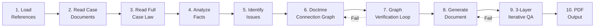

# legal-case-harness

[](LICENSE)
[](https://claude.ai/claude-code)
[](README.md)
[](#)

A Claude Code harness and skill for systematic generation of Korean administrative law documents.
Includes 37 legal doctrines, 27 case citations, and 6 document templates extracted from 3 real administrative adjudication cases, with a 10-step pipeline and 3-layer automated quality verification.

## Overview



## Core Components

### `.claude/skills/legal-harness/` -- Document Generation Skill

Generates legal documents via the `/legal-harness [case] [type]` command in Claude Code.

- 10-step generation pipeline (see Overview)
- Full-text loading principle: all case law and statutes are loaded in full, not as snippets
- 3-layer iterative quality verification: repeats until all 15 checklist categories pass

### `harness/` -- Reference Harness

| File | Contents |
|------|----------|
| `01_법리_데이터베이스.md` | 37 legal doctrines (ID, case law, holdings, argument structure, application examples) |
| `02_판례_인용_사전.md` | 27 case citations with exact citation format and original holdings |
| `02-1_법조문_인용_사전.md` | Statute text verbatim (for citation cross-checking) |
| `03_문서_구조_템플릿.md` | 6 document type templates with outline, numbering, and section rules |
| `04_표현_사전.md` | 16-category standardized expression patterns |
| `05_품질_기준_및_검증.md` | 15-category quality checklist |
| `06_생성_메타프롬프트.md` | Claude system prompt and type-specific generation instructions |
| `07_논증_가이드라인.md` | Argumentation error examples and corrections |
| `08_PDF_서식_사양.md` | PDF output spec (A4, Noto Serif CJK KR) |
| `09_문서_지도.md` | Full directory map and per-case document classification |
| `10_유지보수_가이드.md` | Harness modification procedure for consistency maintenance |

### `.claude/skills/extract-documents/` -- Document Extraction Skill

Extracts text from PDF, HWP, DOCX, images, audio, and video files.

- 7 extraction methods: direct text read, PDF text layer, OCR, HWP conversion, DOCX XML parsing, STT, video frame OCR
- Per-page PDF classification logic: auto-detects text, image, and vector pages

## Directory Structure

```
legal-case-harness/
├── .claude/                    # Claude Code config & skills
│   ├── CLAUDE.md
│   ├── settings.json
│   └── skills/
│       ├── extract-documents/  # Document extraction skill
│       └── legal-harness/      # Legal document generation skill
├── harness/                    # Reference harness
├── extract_all.py              # Document extraction script
├── cases/                      # Case documents (anonymized)
│   ├── 01_공사소음/            # Construction noise FOIA case
│   ├── 02_대동제/              # Festival outsourcing FOIA case
│   └── 03_성희롱/              # Sexual harassment FOIA case
└── 법령_판례/                  # Statutes & case law (public records)
    ├── 법률_시행령/            # Statutes & enforcement decrees
    ├── 별표_고시/              # Annexed tables & public notices
    ├── 판례/                   # Case law
    ├── 재결례/                 # Adjudication decisions
    ├── 경북대_내규/            # Kyungpook National University bylaws
    └── 기타_참고/              # Other references
```

## Case Overview

| Case | Type | Respondent | Status |
|------|------|-----------|--------|
| Construction Noise (공사소음) | Construction noise/fugitive dust FOIA | KNU Facilities Division | Adjudication in progress |
| Festival Outsourcing (대동제) | Festival vendor contract FOIA | KNU Student Affairs Division | Adjudication in progress |
| Sexual Harassment (성희롱) | Group chat harassment FOIA | KNU Human Rights Center | Adjudication in progress |

All case documents are anonymized with personal information removed.

## Legal Doctrine Coverage

| Category | Count | Examples |
|----------|-------|---------|
| FOIA (정보공개법) | 24 | Partial disclosure principle, non-disclosure grounds (Art. 9(1) Nos. 1-7, incl. 5 sub-grounds under No. 5 and 3 under No. 6), statement of reasons, non-existence, electronic disclosure, disclosure method, specificity, burden of proof, Public Records Act linkage, dispositionality, abuse-of-right defense limitation |
| Administrative Adjudication (행정심판) | 5 | Dispositionality, inaction (omission), legal nature of supplementation requests, consolidated hearing, limitation on adding/changing grounds for disposition |
| Civil Complaints & Discipline (민원·징계) | 5 | Criminal-administrative separation, mandatory duty (discretion reduction), victim protection, academic record change prohibition, bylaw amendment purpose |
| Environmental Law (환경법) | 3 | Fugitive dust notification, advance notification for designated construction, ordering party liability |

## Usage

### With Claude Code

```
/legal-harness 공사소음 보충서면
/legal-harness 대동제 청구이유서
/legal-harness 성희롱 정보공개청구 별지
```

### Manual Reference

1. Check document structure in `03_문서_구조_템플릿.md` for the target document type
2. Select applicable doctrines from `01_법리_데이터베이스.md`
3. Cite case law only from `02_판례_인용_사전.md` verbatim
4. Use standardized expressions from `04_표현_사전.md`
5. Verify with `05_품질_기준_및_검증.md` checklist

## Supported Document Types

| Type | Output |
|------|--------|
| Complaint to e-People (국민신문고 민원) | Text |
| FOIA request body (정보공개청구서 본문) | Text |
| FOIA request appendix (정보공개청구 별지) | PDF |
| Legal doctrine supplement (법리보충 참고자료) | PDF |
| FOIA request summary (정보공개청구 요약본) | PDF |
| Administrative adjudication brief (행정심판 청구이유서) | PDF |
| Supplementary brief (보충서면) | PDF |

## Document Extraction Tool

`extract_all.py` extracts text from a given file and prints to stdout.

```bash
python3 extract_all.py "법령_판례/판례/대법원_2003두8050.pdf"
python3 extract_all.py "법령_판례/경북대_내규/경북대학교_학칙(규정_제2856호).pdf"
```

### Dependencies

- PyMuPDF (`fitz`)
- EasyOCR
- pyhwp (`hwp5html`)
- faster-whisper
- ffmpeg
- Pillow

## Data Source

Legal doctrines, case citations, document structures, and expression patterns were extracted from 76 key documents generated across 3 administrative adjudication cases (Apr.-Jun. 2026).

## Contributing

Issues and pull requests are welcome. When modifying the `harness/` directory, follow the consistency maintenance procedure in `harness/10_유지보수_가이드.md`.

## License

MIT License
