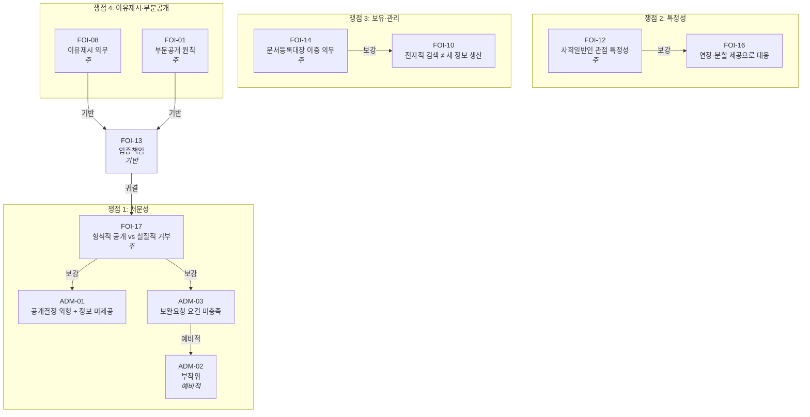

# 법리 연결 그래프: 공사소음 행정심판청구서

## A. 구조화 데이터 (JSON)

```json
{
  "document": "행정심판청구서_공사소음_16514785",
  "issues": [
    {
      "id": 1,
      "title": "이 사건 통지의 처분성",
      "doctrines": [
        {
          "code": "FOI-17",
          "role": "주",
          "cases": ["2016두44674", "2007구합20416"],
          "subsumption": "외형상 공개 결정이나 정보 일체 미제공. 공개방법 제한조차 거부로 평가되는데, 정보 미교부는 그보다 한층 중한 거부",
          "conclusion": "이 사건 통지는 실질적 거부처분"
        },
        {
          "code": "ADM-01",
          "role": "보강",
          "parent": "FOI-17",
          "cases": ["2013-20698"],
          "subsumption": "청구 정보와 상이한 내용(보정 요청)만 기재. 재결 제2013-20698호의 사안과 동일 구조",
          "conclusion": "형식적 공개처분, 실질은 거부처분"
        },
        {
          "code": "ADM-03",
          "role": "보강",
          "parent": "FOI-17",
          "cases": [],
          "subsumption": "연장 사유(복잡하여)와 처분 사유(특정 곤란)의 모순. 접수 후 27일 경과 시점의 보정 요구. 보완기간 미설정, 결정통지서 양식 사용, 후속 처분 부존재",
          "conclusion": "민원처리법 보완요청 요건 미충족. 정보공개법에 근거한 종결적 행정행위"
        },
        {
          "code": "ADM-02",
          "role": "예비적",
          "parent": "ADM-03",
          "cases": [],
          "subsumption": "설령 보완요청으로 보더라도, 연장된 결정기간(5. 26.) 도과 후에도 종국적 처분 부존재",
          "conclusion": "위법한 부작위 존재"
        }
      ]
    },
    {
      "id": 2,
      "title": "청구의 특정성과 광범위성의 처리",
      "doctrines": [
        {
          "code": "FOI-12",
          "role": "주",
          "cases": ["2014두5477", "2007두2555"],
          "subsumption": "3개 사업명, 담당 부서(시설과), 문서 유형(문서등록대장·정보목록), 8개 메타데이터 항목을 별지로 특정. 외부인이 도달할 수 있는 특정의 최선이자 한계",
          "conclusion": "사회일반인 기준 충족. 피청구인이 요구한 기간·키워드 특정은 내부 시스템 사전 지식 전제로 부당"
        },
        {
          "code": "FOI-16",
          "role": "보강",
          "parent": "FOI-12",
          "cases": [],
          "subsumption": "정보공개법 제11조 제2항(연장), 제13조 제3항(분할 제공)이 광범위한 청구에 대한 처리 경로를 명시. 청구인은 별지에서 분할 제공에 동의하였음. 피청구인은 이미 연장권을 행사하였으면서 연장 기간 내 실질 판단을 하지 않고 재특정만 요구",
          "conclusion": "광범위성은 처리방법으로 대응할 사항이지 거부 사유가 아님"
        }
      ]
    },
    {
      "id": 3,
      "title": "청구 정보의 보유·관리 가능성",
      "doctrines": [
        {
          "code": "FOI-14",
          "role": "주",
          "cases": [],
          "subsumption": "공공기록물법 제18조·시행령 제20조(등록 의무) + 정보공개법 제8조·시행령 제5조(정보목록 작성·비치·공개 의무). 시행문서번호(시설과-5655, 시설과-6244)가 부여된 문서를 작성·시행하면서 등록대장 부존재는 주장 불가",
          "conclusion": "두 법령이 중첩적으로 강제하는 정보의 보유 개연성은 사실상 확정적"
        },
        {
          "code": "FOI-10",
          "role": "보강",
          "parent": "FOI-14",
          "cases": ["2009두6001"],
          "subsumption": "피청구인의 전자문서시스템은 문서등록정보를 구조화된 형태로 보유하고 있고(기초자료 존재), 부서별·기간별·제목별 검색 및 목록 추출 기능을 통상의 컴퓨터 하드웨어·소프트웨어로 수행할 수 있으며(통상 시스템으로 검색·편집 가능), 이러한 추출 작업이 시스템 운용에 별다른 지장을 초래하지 않음(시스템 운용 무지장). 3요건 충족",
          "conclusion": "문서등록대장 추출은 새로운 정보의 생산 또는 가공이 아님"
        }
      ]
    },
    {
      "id": 4,
      "title": "이유제시 의무 위반 및 부분공개 의무 위반",
      "doctrines": [
        {
          "code": "FOI-08",
          "role": "주",
          "cases": ["2001두8827"],
          "subsumption": "비공개 근거조항란·비공개 내용·사유란 모두 공란. '범위 광범위', '검색 기준 곤란'은 정보공개법 제9조 제1항 각 호 어디에도 근거하지 않는 추상적 표현",
          "conclusion": "이유제시 의무(제13조 제5항) 위반. 개괄적 사유에도 미달"
        },
        {
          "code": "FOI-01",
          "role": "주",
          "cases": ["2009두12785"],
          "subsumption": "3개 사업 각각, 생산/접수 문서 구분, 8개 메타데이터 항목별로 독립적 분리·추출 가능. 별지 제5항에서 분리 공개 단위를 명시하였음에도 피청구인은 분리 가능성 미검토",
          "conclusion": "일괄 재특정 요구는 부분공개 의무(제14조) 위반"
        },
        {
          "code": "FOI-13",
          "role": "기반",
          "parent": "FOI-08",
          "cases": ["2001두8827"],
          "subsumption": "비공개 사유의 입증책임은 피청구인에. 객관적 자료에 의한 고도의 개연성 필요",
          "conclusion": "추상적 사유만으로는 입증책임 미충족"
        }
      ]
    }
  ],
  "edges": [
    {"from": "FOI-17", "to": "ADM-01", "type": "보강"},
    {"from": "FOI-17", "to": "ADM-03", "type": "보강"},
    {"from": "ADM-03", "to": "ADM-02", "type": "예비적"},
    {"from": "FOI-12", "to": "FOI-16", "type": "보강"},
    {"from": "FOI-14", "to": "FOI-10", "type": "보강"},
    {"from": "FOI-08", "to": "FOI-13", "type": "기반"},
    {"from": "FOI-01", "to": "FOI-13", "type": "기반"},
    {"from": "FOI-13", "to": "FOI-17", "type": "귀결"}
  ]
}
```

## B. 시각 다이어그램 (Mermaid)


