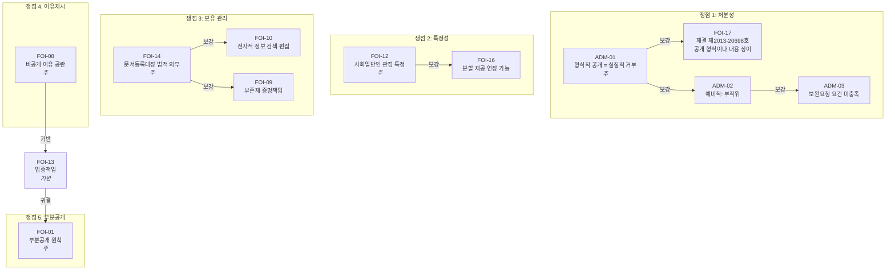

# 법리 연결 그래프: 행정심판청구서 (재작성)

## A. 구조화 데이터 (JSON)

```json
{
  "document": "행정심판청구서_재작성",
  "issues": [
    {
      "id": 1,
      "title": "이 사건 결정의 처분성",
      "doctrines": [
        {
          "code": "ADM-01",
          "role": "주",
          "cases": ["2016두44674"],
          "subsumption": "결정통지서 양식으로 공개 표시하였으나 실제 정보 미제공, 보정 요청만 기재. 공개일시 도과 후에도 정보 미교부",
          "conclusion": "공개결정의 외형과 정보 미제공의 실질이 병존하므로 실질적 거부처분"
        },
        {
          "code": "FOI-17",
          "role": "보강",
          "parent": "ADM-01",
          "cases": [],
          "subsumption": "재결 제2013-20698호 사안과 동일한 구조. 공개 결정 형식이나 청구 정보와 내용 상이"
        },
        {
          "code": "ADM-02",
          "role": "보강",
          "parent": "ADM-01",
          "cases": [],
          "subsumption": "설령 보완요청으로 보더라도 후속 종국적 처분 없음. 연장된 결정기간(2026.05.26)도 도과"
        },
        {
          "code": "ADM-03",
          "role": "보강",
          "parent": "ADM-02",
          "cases": [],
          "subsumption": "보완기간 미설정. 청구 접수 후 27일 경과 시점에 보정 요구. 민원처리법 제22조 요건 미충족"
        }
      ]
    },
    {
      "id": 2,
      "title": "청구의 특정성 충족",
      "doctrines": [
        {
          "code": "FOI-12",
          "role": "주",
          "cases": ["2014두5477", "2007두2555"],
          "subsumption": "대상 사업 3건, 담당 부서(시설과), 문서 유형(문서등록대장·정보목록) 특정. 사회일반인 관점에서 내용과 범위 확정 가능",
          "conclusion": "광범위성은 분할 제공(제13조 제3항) 또는 연장(제11조 제2항)으로 대응할 사항이지 거부 사유가 아님"
        },
        {
          "code": "FOI-16",
          "role": "보강",
          "parent": "FOI-12",
          "cases": [],
          "subsumption": "피청구인은 이미 10일 연장을 사용. 분할 제공이 가능하였음에도 일괄 보정 요청"
        }
      ]
    },
    {
      "id": 3,
      "title": "문서등록대장·정보목록의 보유·관리",
      "doctrines": [
        {
          "code": "FOI-14",
          "role": "주",
          "cases": [],
          "subsumption": "공공기록물법 제18조 및 정보공개법 제8조·시행령 제5조가 중첩적으로 작성·관리·공개를 강제. 피청구인 자신이 시행문서번호(시설과-5655, 시설과-6244)를 부여",
          "conclusion": "문서등록대장의 보유 개연성은 사실상 확정적"
        },
        {
          "code": "FOI-10",
          "role": "보강",
          "parent": "FOI-14",
          "cases": ["2009두6001"],
          "subsumption": "전자문서시스템(코러스 등)에서 부서별·기간별 검색 및 추출 가능. 새로운 정보 생산이 아님"
        },
        {
          "code": "FOI-09",
          "role": "보강",
          "parent": "FOI-14",
          "cases": ["2010두18918", "2003두12707"],
          "subsumption": "청구인은 보유 개연성 입증으로 족함. 부존재의 증명책임은 피청구인"
        }
      ]
    },
    {
      "id": 4,
      "title": "이유제시의무 위반",
      "doctrines": [
        {
          "code": "FOI-08",
          "role": "주",
          "cases": ["2001두8827"],
          "subsumption": "결정통지서의 비공개 근거 조항란 및 비공개 내용·사유란이 공란. 실질적 거부이면서 비공개 이유 미제시",
          "conclusion": "정보공개법 제13조 제5항 및 행정절차법 제23조 위반"
        },
        {
          "code": "FOI-13",
          "role": "기반",
          "cases": ["2001두8827", "2009두19021"],
          "subsumption": "공개가 원칙이고 비공개는 예외. 비공개 사유의 입증은 피청구인 부담"
        }
      ]
    },
    {
      "id": 5,
      "title": "부분공개 의무 위반",
      "doctrines": [
        {
          "code": "FOI-01",
          "role": "주",
          "cases": ["2003두12707"],
          "subsumption": "청구 범위 중 특정 가능한 부분(사업별, 기간별)이라도 우선 공개 가능. 일괄 보정 요청은 부분공개 검토를 누락한 것",
          "conclusion": "정보공개법 제14조 위반"
        }
      ]
    }
  ],
  "edges": [
    {"from": "ADM-01", "to": "FOI-17", "type": "보강"},
    {"from": "ADM-01", "to": "ADM-02", "type": "보강"},
    {"from": "ADM-02", "to": "ADM-03", "type": "보강"},
    {"from": "FOI-12", "to": "FOI-16", "type": "보강"},
    {"from": "FOI-14", "to": "FOI-10", "type": "보강"},
    {"from": "FOI-14", "to": "FOI-09", "type": "보강"},
    {"from": "FOI-08", "to": "FOI-13", "type": "기반"},
    {"from": "FOI-13", "to": "FOI-01", "type": "귀결"}
  ]
}
```

## B. 시각 다이어그램 (Mermaid)



## 검증 이력

### 회차 1
- Phase 1 (스크립트): pass
- Phase 2 (내용 평가): pass (hash: f58fc49e2b9d)

### 회차 2
- Phase 1 (스크립트): pass (2007구합20416 제거)
- Phase 2 (내용 평가): pass (hash: abb139f80b2d)

### 회차 3
- Phase 1 (스크립트): pass (2009두12785 제거)
- Phase 2 (내용 평가): pass (hash: aa59c79e4b50)

### 회차 4
- Phase 1 (스크립트): pass (FOI-17 cases에서 2013-20698 제거, 포섭 텍스트 유지)
- Phase 2 (내용 평가): pass (hash: 409d99556c6f)
