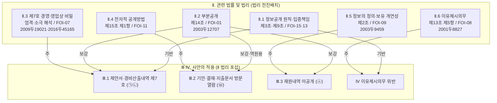

# 법리그래프: 대동제 2차 심판 보충서면 (2026-10986)

피청구인 답변서(2026. 6. 29.)에 대응하는 논증 계획. 피청구인이 원용한 판례 2건(2009두19021·2003두12707)을 역원용하는 것을 전략 축으로 한다.

> **구조(사용자 재구성 지시, 2026-07-01)**: (1) Ⅰ은 "이 사건의 쟁점" 나열을 폐지하고, 답변서 주장 요지를 소개한 뒤 "이 보충서면은 그 중 ㉠㉡ 제7호·㉥ 방문열람·㉦ 재원내역 및 이유제시에 관하여 보충한다"는 범위 한정 방식으로 작성한다. 답변서가 주장한 ㉤ 회의록·㉢ 조사표 부존재는 소개하되 보충 대상에서 제외하고 청구이유서 기재에 따름을 명시한다. (2) 이 보충서면이 활용하는 **모든 법리를 Ⅱ에 전진배치**하고, 각 법리 항목에 관련 판례를 인용한다. Ⅲ·Ⅳ는 Ⅱ 법리를 각 쟁점에 포섭하는 적용 파트로서 새로운 법리·판례를 처음 도입하지 않는다. 아래 JSON의 issues는 Ⅲ·Ⅳ(사안 적용)에 대응하고, Ⅱ 총론 배치는 "Ⅱ 법리 전진배치 매핑"에 정리한다.

> **쟁점 범위(사용자 지시로 4개로 확정)**: 회의록(㉤)·학생선호도조사표(㉢)의 부존재 쟁점은 보충서면에서 다투지 아니한다. 남는 쟁점은 ㉠㉡ 제7호 비공개, ㉥ 방문열람, ㉦ 재원내역 미공개, 이유제시이며, 이는 청구취지(청구서 가·나·다)와 정합한다.

> **부존재 법리 주의**: 보유·관리의 상당한 개연성은 원칙적으로 청구인이 입증한다(2003두9459·2003두12707). 공공기관이 증명책임을 지는 것은 "한 때 보유 후 폐기" 사실에 한한다. 본 그래프에서 보유 개연성 법리가 적용되는 곳은 쟁점 다(㉦)뿐이고, ㉦은 부존재가 아니라 '기록 미제공' 쟁점이다.

> **제7호 판례 어법 주의**: 2009두19021의 제7호 판시는 "정당한 이익을 입법 취지에 비추어 엄격하게 판단"까지이고, "공공성이 큰 경우 정당한 이익을 더욱 소극적으로 해석"은 2016두45165의 판시이다. 제7호는 비교교량(이익형량) 구조가 아니라 정당한 이익을 엄격·소극적으로 해석하는 일면 구조이므로, "공익이 우월하다"는 형량 어법이 아니라 "공익이 크므로 정당한 이익을 소극적으로 해석하여 부정한다"는 어법을 사용한다.

## A. 구조화 데이터 (JSON)

```json
{
  "document": "보충서면_2026-10986",
  "issues": [
    {
      "id": 1,
      "title": "제안서·경비산출내역 제7호 비공개의 위법 (㉠㉡)",
      "doctrines": [
        {
          "code": "FOI-07",
          "role": "주",
          "cases": ["2009두19021", "2016두45165"],
          "subsumption": "Ⅱ.3에서 세운 제7호 정당한 이익의 엄격·소극 해석 법리(2009두19021·2016두45165)를 이 쟁점에 적용한다. 피청구인은 바로 그 2009두19021을 비공개 근거로 원용하였으나, 위 판례는 제7호의 정당한 이익을 입법 취지에 비추어 엄격하게 판단할 것을 요구하고 사업활동 비밀이 일부 포함되어도 정보의 내용·성격에 따라 정당한 이익을 부정할 수 있음을 보인 것이다. 제안서의 객관적 부분(행사 프로그램 구성·라인업 제안·발주조건 충족 여부)과 경비산출내역의 객관적 부분(총 섭외비·항목별 합계·금액 구간)은 노하우·협상전략 등 순수 영업비밀과 구별되고, 청구인은 세부 원가구조·개별 단가의 가림을 수용한다. 본 용역은 국립대학인 피청구인이 약 3억 5,000만 원의 공적 재원을 들여 발주한 학생을 위한 대동제 행사의 기획·대행에 관한 것으로서, 공적 재원이 투입된 국립대학 행사라는 점에서 국민의 감시 필요성과 국정운영의 투명성 확보 요청이 커 정당한 이익을 더욱 소극적으로 해석할 영역에 해당한다(2016두45165 유추). 업체를 선정한 기술평가위원회는 피청구인 및 다른 국립대학의 행정 담당자로 구성되어 정작 수요자인 학생은 어떠한 행사 구성·출연진이 제안되어 평가의 대상이 되었는지를 확인할 통로를 갖지 못하였고, 그 제안의 구체적 내용을 확인할 수 있는 사실상 유일한 자료는 제안서이다(피청구인이 별개의 정보공개청구에 대한 회신에서 기술평가점수 등 평가 결과를 공개하였더라도 이는 평가의 결과일 뿐 각 제안의 구체적 내용 자체와는 구별된다). 공적 재원으로 자신을 위하여 개최되는 축제의 기획·선정 과정을 그 수요자인 학생이 확인할 수 있게 하는 것은 국민의 알 권리 보장과 국정운영의 투명성 확보에 부합하는 공익으로서, 이 또한 정당한 이익을 더욱 소극적으로 해석할 사정에 해당한다. 나아가 피청구인이 원문 공개한 제안요청서는 제안에 의한 산출물의 소유권이 피청구기관에 귀속되고 제안 내용이 계약서와 동일한 효력을 가진다고 정하므로(제안조건 라·마), 적어도 낙찰자가 제안하여 이 사건 용역의 계약 내용을 이루게 된 객관적 부분은 업체가 배타적으로 보유하는 사적 영업비밀이 아니라 피청구기관이 소유권을 갖고 계약상 구속력을 부여한 공적 계약의 내용에 해당하고, 청구인은 업체의 일반적 노하우·향후 사업전략이 아니라 그 공적 계약 내용을 이루는 객관적 부분의 공개를 구하는 것이므로 그 부분에 대하여 업체가 거부할 정당한 이익은 더욱 약화된다.",
          "conclusion": "공적 재원이 투입된 국립대 행사의 공공성과 수요자 학생의 확인 공익에 비추어 정당한 이익을 소극적으로 해석하고, 낙찰자 제안의 객관적 부분은 공적 계약의 내용을 이루므로, 객관적 부분까지 일괄 비공개할 정당한 이익은 인정되기 어려움, 제7호·제14조 위반"
        },
        {
          "code": "FOI-01",
          "role": "보강",
          "parent": "FOI-07",
          "cases": [],
          "subsumption": "Ⅱ.2 부분공개 법리(2003두12707)에 따라, 객관적 부분의 분리가 가능함에도 피청구인은 분리 가능성을 검토하지 않고 문서 전체를 일괄 비공개하였다."
        },
        {
          "code": "FOI-13",
          "role": "기반",
          "parent": "FOI-07",
          "cases": [],
          "subsumption": "Ⅱ.1 입증책임 법리에 따라, 공개가 원칙이고 비공개는 예외이므로 어느 부분이 어떤 정당한 이익을 현저히 해하는지에 대한 입증책임은 비공개를 주장하는 피청구인에게 있다."
        }
      ]
    },
    {
      "id": 2,
      "title": "기안·결재·지출문서 방문열람 한정의 위법 (㉥)",
      "doctrines": [
        {
          "code": "FOI-11",
          "role": "주",
          "cases": [],
          "subsumption": "Ⅱ.4에서 세운 제15조 제1항 법리를 이 쟁점에 적용한다. 피청구인은 ㉥ 문서를 전자적 형태로 보유함을 자인하였고 청구인이 전자적 공개를 요청하였으므로, 피청구인은 그 정보의 성질상 현저히 곤란한 경우가 아닌 한 청구인의 요청에 따라야 한다. 피청구인이 내세우는 곤란은 비공개 부분을 식별하여 가리는 작업의 부담일 뿐이고, ㉥ 내부 기안·결재·지출문서는 업체가 제출한 제안서·가격산출내역 원본과 구별되는 별개의 행정문서로서 피청구인이 내세우는 '유기적 결합'의 전제부터 분명하지 않고 가려야 할 부분은 한정적이므로, 전자적 공개가 정보의 성질상 현저히 곤란한 경우에 해당한다고 볼 수 없다.",
          "conclusion": "방문열람 한정은 제15조 제1항 위반"
        },
        {
          "code": "FOI-01",
          "role": "보강",
          "parent": "FOI-11",
          "cases": ["2003두12707"],
          "subsumption": "Ⅱ.2에서 세운 부분공개 법리(2003두12707)를 적용한다. 피청구인이 방문열람 근거로 원용한 바로 그 2003두12707은 비공개 부분을 제외하고 나머지를 공개하는 부분공개(분리공개)를 명한 판례로 오히려 분리공개를 전제한다. 무엇을 가릴 것인지를 식별하는 작업은 어느 공개방법에 의하더라도 동일하고, 식별된 부분을 전자적으로 가리는 것은 통상의 문서편집 기능으로 수행할 수 있다. 마스킹은 방문열람의 방법에 의하더라도 동일하게 선행되어야 함을 피청구인 스스로 자인하였으므로, 마스킹의 필요(공개내용)와 전자파일 교부 여부(공개방법)는 별개 차원의 문제이다."
        }
      ]
    },
    {
      "id": 3,
      "title": "재원내역 자료 미공개의 위법 (㉦)",
      "doctrines": [
        {
          "code": "FOI-09",
          "role": "주",
          "cases": ["2003두9459"],
          "subsumption": "Ⅱ.5에서 세운 정보의 정의(제2조 제1호·제2호)와 보유 개연성 법리(2003두9459)를 적용한다. 정보공개란 청구된 기록 자체를 제공하는 것이고 그 내용에 관한 답변·설명은 공개가 아니다. 피청구인은 형식상 '대학회계'라는 회신만 하였을 뿐 청구된 예산 배정·세출예산 과목 등 회계기록 자체를 제공하지 않았고, 그 근거로 든 입찰공고문(을 제2호증)에는 재원 구분(학교회계·학생자치회비) 정보가 기재되어 있지 않다. 피청구인은 회계기록의 공개 요구가 당초 청구 범위를 넘는다고 주장하나, 청구인은 원 청구(별지)에서 예산 배정 및 세출예산 과목 등에 관한 회계 기록의 공개를 명시적으로 구하였으므로 이는 청구 범위 내의 것이다. 3억 5천만 원 공적 계약의 예산 배정·지출에 관한 회계기록의 보유 개연성은 청구인이 입증하는 바와 같이 인정되므로, 피청구인은 보유 범위에서 이를 청구인이 신청한 전자적 형태로 공개하여야 한다.",
          "conclusion": "재원내역 기록 자체를 공개하지 아니한 것은 위법"
        },
        {
          "code": "FOI-01",
          "role": "보강",
          "parent": "FOI-09",
          "cases": [],
          "subsumption": "Ⅱ.2 부분공개 법리에 따라, 재원내역 회계기록의 일부에 비공개 사유가 있으면 제14조에 따라 그 부분을 제외하고 분리하여 공개하여야 한다."
        }
      ]
    },
    {
      "id": 4,
      "title": "이유제시의무 위반 및 입증책임",
      "doctrines": [
        {
          "code": "FOI-08",
          "role": "주",
          "cases": ["2001두8827"],
          "subsumption": "Ⅱ.6에서 세운 이유제시 법리(2001두8827)를 적용한다. 결정통지서의 비공개 근거조항·사유란이 공란이고, 첨부 답변서도 제7호를 적시하였을 뿐 어느 부분이 어떠한 이유로 비공개대상에 해당하는지와 부분공개 가능성 검토 결과를 구체적으로 밝히지 않았다. ㉥의 공개방법 제한에 관하여도 '기술적 곤란'이라는 추상적 사유만을 제시하였다. 개괄적 사유만으로 한 공개 거부는 허용되지 않는다.",
          "conclusion": "제13조 제5항 이유제시의무 위반"
        },
        {
          "code": "FOI-13",
          "role": "기반",
          "parent": "FOI-08",
          "cases": [],
          "subsumption": "Ⅱ.1 입증책임 법리에 따라, 비공개·공개방법 제한의 정당성은 추상적 우려가 아니라 객관적 자료로 피청구인이 입증하여야 한다."
        }
      ]
    }
  ],
  "edges": [
    {"from": "FOI-07", "to": "FOI-01", "type": "보강"},
    {"from": "FOI-07", "to": "FOI-13", "type": "기반"},
    {"from": "FOI-11", "to": "FOI-01", "type": "보강"},
    {"from": "FOI-09", "to": "FOI-01", "type": "보강"},
    {"from": "FOI-08", "to": "FOI-13", "type": "기반"}
  ]
}
```

## Ⅱ 법리 전진배치 매핑

Ⅱ(관련 법률 및 법리)에 집약되는 법리와 각 항의 판례. Ⅲ·Ⅳ는 아래 Ⅱ 법리를 참조·적용하며 새 법리·판례를 처음 도입하지 않는다.

| Ⅱ 항 | 법리(코드) | 근거 조문 | 인용 판례 | 적용되는 Ⅲ·Ⅳ 쟁점 |
|------|-----------|----------|-----------|------------------|
| Ⅱ.1 | 정보공개 원칙·비공개 입증책임 (FOI-15·FOI-13) | 제3조, 제9조 제1항 | (조문 구조) | 전 쟁점의 기반, Ⅳ |
| Ⅱ.2 | 부분공개 원칙 (FOI-01) | 제14조 | 2003두12707 | Ⅲ.1, Ⅲ.2(역원용), Ⅲ.3 |
| Ⅱ.3 | 경영·영업상 비밀 비공개의 엄격·소극 해석 (FOI-07) | 제9조 제1항 제7호 | 2009두19021, 2016두45165 | Ⅲ.1 |
| Ⅱ.4 | 전자적 형태 정보의 공개방법 (FOI-11) | 제15조 제1항 | (조문 법리) | Ⅲ.2 |
| Ⅱ.5 | 정보공개의 의미·보유 정보의 공개 (FOI-09) | 제2조 제1호·제2호 | 2003두9459 | Ⅲ.3 |
| Ⅱ.6 | 비공개 결정의 이유제시의무 (FOI-08) | 제13조 제5항 | 2001두8827 | Ⅳ |

## B. 시각 다이어그램 (Mermaid)



## 판례 사용 계획

| 판례 | Ⅱ 법리 배치 | Ⅲ·Ⅳ 적용 쟁점 | 역할 |
|------|-----------|------------|------|
| 2009두19021 | Ⅱ.3 제7호 | Ⅲ.1 (㉠㉡) | 피청구인 원용 → 역원용(정당한 이익 엄격 판단) |
| 2016두45165 | Ⅱ.3 제7호 | Ⅲ.1 (㉠㉡) | 공공성·공익성이 큰 경우 정당한 이익 소극 해석 |
| 2003두12707 | Ⅱ.2 부분공개 | Ⅲ.2 (㉥) 중심, Ⅲ.1·Ⅲ.3 공통 | 피청구인 원용 → 역원용(분리공개 원칙) |
| 2003두9459 | Ⅱ.5 보유 개연성 | Ⅲ.3 (㉦) | 보유 개연성 입증 구조(재원 회계기록) |
| 2001두8827 | Ⅱ.6 이유제시 | Ⅳ | 이유제시의무, 개괄적 사유 불허 |

미수록 2005구합32928(피청구인이 답변서에서 원용)은 새로 인용하지 않고, 피청구인이 원용한 내용을 받아 "비공개대상정보만 제외하고 나머지는 공개"라는 부분공개 전제임을 지적하는 데 그친다.

## 드랍한 쟁점 (사용자 지시)

- **㉤ 기술평가위원회 심사 회의록 객관적 부분·부존재**: 사용자 지시로 보충서면에서 다투지 아니한다. 이에 따라 회의록 분리공개·부존재 논증에 쓰이던 FOI-05-C·FOI-05-B 및 판례 2010두18918·2009두12785를 제거하였다. Ⅰ.1(답변서 주장 요지)에서는 답변서가 회의록 부존재를 주장하였음을 소개하되, Ⅰ.2(보충 범위)에서 보충 대상에서 제외하고 청구이유서 기재에 따름을 명시한다.
- **㉢ 학생 선호도 조사표 부존재**: 사용자 지시로 보충서면에서 다투지 아니한다. ㉤와 동일하게 Ⅰ에서 소개하되 대상에서 제외함을 명시한다.

## 보강 검토 후 제외한 법리

7단계 독립 평가(criterion 8)에서 FOI-17·FOI-10의 보강이 제안되었으나, 다음 사유로 제외한다(연관 법리는 참고하되 이 사건에 적합한 연결만 선택).

- **FOI-17(형식적 공개 vs 실질적 거부)**: 본 사건은 이미 행정심판이 계속 중이고 피청구인도 처분성을 다투지 아니하므로, 처분성 논거를 도입하면 논점이 분산된다. ㉦의 "형식상 공개이나 실질 미제공"이라는 점은 처분성이 아니라 정보공개법 제2조(정보·공개의 정의)로 직접 논증하며, 이를 Ⅱ.5 및 쟁점 다의 FOI-09 포섭에 반영하였다.
- **FOI-10(전자적 정보의 검색·편집은 새로운 정보 생산 아님)**: 피청구인은 ㉥·㉦에 대하여 '새로운 정보의 생산'을 주장하지 않았다. 상대방이 원용하지 않은 쟁점을 선제적으로 도입하지 않는다는 원칙(논증_가이드라인 §5 취지)에 따라 제외하고, "전자적 마스킹은 통상의 문서편집 기능으로 수행할 수 있다"는 취지는 쟁점 나의 FOI-11·FOI-01 포섭에 반영하였다.

## 검증 이력

### 회차 1
- Phase 1 (스크립트): pass
- Phase 2 (내용 평가): fail → 사용자 피드백(부존재 입증책임 오류: 보유 개연성은 청구인이 입증, 공공기관은 '폐기' 사실만 입증)과 독립 평가 criterion 8(FOI-17·FOI-10 보강 제안)을 종합. 쟁점 포섭을 보유 개연성 입증·성실 검색 의무 구조로 재구성, 부존재 입증책임 단정 삭제, 쟁점 2 FOI-11 포섭에 '유기적 결합' 전제 반박 추가, FOI-17·FOI-10은 제외 근거 명시.

### 회차 2
- Phase 1 (스크립트): pass
- Phase 2 (내용 평가): pass — 독립 평가 8개 기준 전부 충족. 부존재 입증책임 교정이 판례 정본과 일치, FOI-17·FOI-10 제외가 합리적임을 확인.

### 회차 3
- Phase 1 (스크립트): pass
- Phase 2 (내용 평가): fail → 사용자 요청으로 쟁점 1에 공익 논거 추가하였으나 criterion 7·8 지적(비교교량 색채·유일성 과대·판례 근거). 결론을 소극 해석 어법으로 교정, 유일성을 '각 업체 제안의 구체적 내용'으로 한정, 2016두45165 병기.

### 회차 4
- Phase 1 (스크립트): pass
- Phase 2 (내용 평가): pass (hash: 123de8a922d2) — 회차 3 지적 3건 모두 해소 확인. '엄격 판단(2009두19021)·소극 해석(2016두45165)' 귀속 정확.

### 회차 5
- Phase 1 (스크립트): pass
- Phase 2 (내용 평가): pass (hash: 9ea565841ff4) — 사용자 추가 지시(2026-07-01)로 회의록(㉤)·학생선호도조사표(㉢) 부존재 쟁점을 드랍하여 6개 쟁점을 4개로 축소. FOI-05-C·FOI-05-B 및 판례 2010두18918·2009두12785가 issues·edges·mermaid·판례표에서 완전히 제거됨을 독립 평가로 확인. 남은 4쟁점이 청구취지(가·나·다+이유제시)와 정합, FOI-09가 재원(㉦) '기록 미제공+보유 개연성' 구조에 적합, FOI-07 포섭의 3차 공개 표현 동기화('기술평가점수 등 평가 결과')가 사실 부합·역이용 위험 없음 확인. 8개 기준 전부 충족.

### 회차 6
- Phase 1 (스크립트): pass
- Phase 2 (내용 평가): pass (hash: c18571ee0692) — 문서 Ⅲ.1에 라.(제안 산출물 소유권 귀속·계약 동일효력) 목차가 신설됨에 맞추어 FOI-07 포섭을 동기화. (1) 공적 재원·국립대학 행사를 '정당한 이익을 더욱 소극적으로 해석할 영역'으로 명시(2016두45165 유추), (2) 수요자 학생의 확인 공익을 '소극 해석 사정'으로 위치(비교교량 어법 회피), (3) 제안조건 라(산출물 소유권 대학 귀속)·마(제안 내용 계약서 동일효력)를 근거로 낙찰자 제안의 객관적 부분이 사적 영업비밀이 아니라 공적 계약의 내용임을 보여 정당한 이익을 약화하는 사실 논거 추가, (4) 위원회 구성 표현을 '외부 행정 전문가 등' → '피청구인 및 다른 국립대학의 행정 담당자'로 정정. 독립 평가 8개 기준 전부 충족: 소유권 논거가 FOI-07(제7호 정당한 이익) 내부의 사실 포섭으로 새 판례·새 청구원인 도입이 아님(criterion 3), 제안조건 라·마 원문(을제3호증 398·400행) 부합·'적어도 낙찰자' 한정이 과대 회피·위원회 구성 정정이 을제1호증_2 공개 명단(경북대 과장1+경북대/충북대/부산대/전북대 행정실장5)과 정확 부합하여 종전 표현이 오히려 부정확했음 확인(criterion 5), 역이용(계약서로 확인·미낙찰자 비귀속·영업비밀성 소멸) 관리 양호하고 시간경과 소멸론 부재로 '노하우 계속 유의미' 반박 미노출(criterion 7). 비치명 관찰: FOI-15(국립대 강화 공개의무, 2004두2783)의 제외 근거가 FOI-17·FOI-10과 달리 미문서화이나, 그 실질이 FOI-07 포섭(공적 재원·국립대·투명성을 소극 해석 사정으로)에 이미 녹아 있고 유일 판례 2004두2783은 사립대 공공기관성 판례로 본건(국립대, 공공기관성 다툼 없음)에 별도 노드 실익이 작아 논증 약화 없음.

### 회차 7 (사용자 첨삭 동기화, 2026-07-01)
- Phase 1 (스크립트): pass
- Phase 2 (내용 평가): pass (hash: 295c95e46bdb) — 사용자 첨삭 지시로 본문 Ⅲ.2에서 2016두44674('일부 거부처분') 논거를 제거하고 제15조 제1항(전자적 보유 정보의 원칙적 공개·정보의 성질상 현저히 곤란 예외) 조문 법리로 대체. 이에 맞추어 본문 Ⅱ에 제15조 제1항 법리를 신설하고, 쟁점 나 FOI-11의 cases를 비운 뒤 포섭을 조문 원칙·예외 구조로 재작성하였으며, Ⅲ.2.다(현저히 곤란 정의 항목)를 삭제하고 소결로 통합. 독립 평가 결과 criterion 3(그래프 내부 표현 불일치: JSON cases 비움 vs mermaid·판례표 잔존)만 fail이었고, JSON cases 비움을 정본으로 하여 mermaid 노드·판례 사용 계획 표에서 2016두44674를 동기화 제거하여 해소함. 서브에이전트는 조문(제15조 제1항) 기반 포섭이 그 자체로 충분하고, 2016두44674가 본안 위법성 판례가 아니라 처분성 판례여서 판례 부재가 본안 논증을 약화시키지 않음을 확인(나머지 7개 기준 pass). 판례 인용 사전 P-015 사용처의 '대동제 보충서면(2026-10986) Ⅲ.2' 표기는 harness 자산이므로 사용자 확인 후 별도 정비.

### 회차 8 (사용자 재구성 지시, 2026-07-01) — Ⅰ 재편·Ⅱ 법리 전진배치
- Phase 1 (스크립트): pass
- Phase 2 (내용 평가): pass (hash: db50bcdb55a3) — 사용자 재구성 지시 2건 반영. (1) Ⅰ을 답변서 주장 요지 소개 + 보충 범위 한정(㉠㉡·㉥·㉦·이유제시) 방식으로 재편, ㉤·㉢ 부존재는 소개 후 대상 제외 명시. (2) 이 보충서면이 활용하는 모든 법리를 Ⅱ에 전진배치(Ⅱ.1~Ⅱ.6)하고 각 법리 항목에 관련 판례 인용(Ⅱ.2 부분공개에 2003두12707 신규 배치, Ⅱ.3 제7호에 2009두19021·2016두45165, Ⅱ.5 보유개연성에 2003두9459, Ⅱ.6 이유제시에 2001두8827; Ⅱ.4 제15조는 조문 법리 유지). "Ⅱ 법리 전진배치 매핑" 섹션 신설, Mermaid를 법리총론(Ⅱ)↔적용(Ⅲ·Ⅳ) 2단 구조로 개편, 판례표에 Ⅱ 배치 열 추가. 각 issue subsumption 첫머리를 "Ⅱ.n에서 세운 법리를 적용한다"로 연결하여 Ⅲ·Ⅳ가 Ⅱ를 포섭하는 관계 명시. 판례 집합(5건)·코드·edges·주 법리 배치 불변이므로 그래프-문서 판례 정합성 유지.
- 독립 평가 결과: criterion 1~8·C 전부 충족(4쟁점 주 법리 배치·법리 선택 적합·주→보강→기반 계층 정합·보강 실질 강화·포섭 사실 정합(을제1~4호증 대조 정확)·논증 순서 자연·역이용 관리 양호·연관 법리 제외 근거 문서화·피청구인 원용 판례 Ⅱ 법리→Ⅲ 역원용 이원 구조 유지). criterion 8 minor 보강 반영: ㉦ '청구 범위 초과' 항변에 대해 청구인이 원 청구(별지)에서 예산 배정·세출예산 과목 회계기록을 명시 청구하여 청구 범위 내임을 FOI-09 포섭에 추가. criterion A·B(그래프-문서 정합)는 산출 문서가 아직 재편 이전 버전이라 fail이었으나 이는 그래프 결함이 아니라 8단계 문서 미작성 상태의 반영이므로, 8단계 문서 재작성으로 해소하고 9단계 문서 검증에서 그래프-문서 정합을 최종 확인한다.
