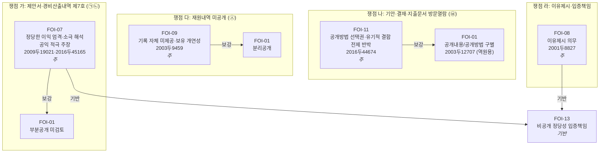

# 법리그래프: 대동제 2차 심판 보충서면 (2026-10986)

피청구인 답변서(2026. 6. 29.)에 대응하는 논증 계획. 피청구인이 원용한 판례 2건(2009두19021·2003두12707)을 역원용하는 것을 전략 축으로 한다.

> **쟁점 범위(사용자 지시로 4개로 확정)**: 회의록(㉤)·학생선호도조사표(㉢)의 부존재 쟁점은 보충서면에서 다투지 아니한다. 남는 쟁점은 ㉠㉡ 제7호 비공개, ㉥ 방문열람, ㉦ 재원내역 미공개, 이유제시이며, 이는 청구취지(청구서 가·나·다)와 정합한다.

> **부존재 법리 주의**: 보유·관리의 상당한 개연성은 원칙적으로 청구인이 입증한다(2003두9459·2003두12707·2010두18918). 공공기관이 증명책임을 지는 것은 "한 때 보유 후 폐기" 사실에 한한다. 본 그래프에서 부존재 법리가 적용되는 곳은 쟁점 다(㉦)의 보유 개연성 논증뿐이고, ㉦은 부존재가 아니라 '기록 미제공' 쟁점이다.

> **제7호 판례 어법 주의**: 2009두19021의 제7호 판시는 "정당한 이익을 입법 취지에 비추어 엄격하게 판단"까지이고, "공공성이 큰 경우 정당한 이익을 더욱 소극적으로 해석"은 2016두45165의 판시이다. 제7호는 비교교량(이익형량) 구조가 아니라 정당한 이익을 엄격·소극적으로 해석하는 일면 구조이므로, "공익이 우월하다"는 형량 어법이 아니라 "공익이 크므로 정당한 이익을 소극적으로 해석하여 부정한다"는 어법을 사용한다.

## A. 구조화 데이터 (JSON)

```json
{
  "document": "보충서면_2026-10986",
  "issues": [
    {
      "id": 1,
      "title": "제안서·경비산출내역 제7호 비공개의 위법 (㉠㉡)",
      "doctrines": [
        {
          "code": "FOI-07",
          "role": "주",
          "cases": ["2009두19021", "2016두45165"],
          "subsumption": "피청구인이 비공개 근거로 원용한 2009두19021은 제7호 정당한 이익을 입법 취지에 비추어 엄격하게 판단하고, 사업활동 비밀이 일부 포함되어도 정보의 내용·성격에 따라 정당한 이익을 부정할 수 있음을 보인 판례이다. 나아가 공공성·공익성이 강하여 국민의 감시 필요성이 큰 경우에는 공개를 거부할 만한 정당한 이익의 존부를 다른 법인 등에 비하여 더욱 소극적으로 해석하여야 한다(2016두45165). 제안서의 객관적 부분(행사 프로그램 구성·라인업 제안·발주조건 충족 여부)과 경비산출내역의 객관적 부분(총 섭외비·항목별 합계·금액 구간)은 노하우·협상전략 등 순수 영업비밀과 구별되고, 청구인은 세부 원가구조·개별 단가의 가림을 수용한다. 본 용역은 학생을 위한 대동제 행사의 기획·대행에 관한 것인데, 업체를 선정한 기술평가위원회는 외부 행정 전문가 등으로 구성되어 정작 수요자인 학생의 의사가 그 심사에 직접 반영되는 구조가 아니었다. 제안서는 각 업체가 어떠한 행사 구성·출연진을 제안하였는지 그 제안의 구체적 내용을 확인할 수 있는 사실상 유일한 자료로서(피청구인이 별개의 정보공개청구에 대한 회신에서 기술평가점수 등 평가 결과를 공개하였더라도 이는 평가의 결과일 뿐 각 제안의 구체적 내용 자체와는 구별된다), 그 객관적 부분의 공개는 학생들이 자신을 위한 축제의 기획이 어떤 선택지 가운데 이루어졌는지를 확인할 수 있게 하는 공익적 가치가 크다. 이러한 공적 감시의 공익에 비추어 업체의 정당한 이익은 더욱 소극적으로 해석되어야 한다.",
          "conclusion": "공적 감시 필요성이 큰 본 용역에서 정당한 이익을 소극적으로 해석하면, 객관적 부분까지 일괄 비공개할 정당한 이익은 인정되기 어려움, 제7호 위반"
        },
        {
          "code": "FOI-01",
          "role": "보강",
          "parent": "FOI-07",
          "cases": [],
          "subsumption": "객관적 부분의 분리가 가능함에도 피청구인은 분리 가능성을 검토하지 않고 문서 전체를 일괄 비공개하였다."
        },
        {
          "code": "FOI-13",
          "role": "기반",
          "parent": "FOI-07",
          "cases": [],
          "subsumption": "공개가 원칙이고 비공개는 예외이므로, 어느 부분이 어떤 정당한 이익을 현저히 해하는지에 대한 입증책임은 비공개를 주장하는 피청구인에게 있다."
        }
      ]
    },
    {
      "id": 2,
      "title": "기안·결재·지출문서 방문열람 한정의 위법 (㉥)",
      "doctrines": [
        {
          "code": "FOI-11",
          "role": "주",
          "cases": ["2016두44674"],
          "subsumption": "피청구인은 ㉥ 문서를 전자적 형태로 보유함을 자인하였다. 전자적 보유 정보에 대해 전자적 공개를 요청한 이상 응할 의무가 있고, 방문열람으로의 변경은 일부 거부처분이다. 제15조 제1항 단서 '정보의 성질상 현저히 곤란한 경우'는 정보 자체의 성질에 관한 것이지 마스킹 작업의 부담에 관한 것이 아니다. 더욱이 ㉥ 내부 기안·결재·지출문서는 업체가 제출한 제안서·가격산출내역 원본과 구별되는 별개의 행정문서로서, 피청구인이 내세우는 '유기적 결합'의 전제부터 분명하지 않고 가려야 할 부분은 한정적이다.",
          "conclusion": "방문열람 한정은 제15조 제1항 위반"
        },
        {
          "code": "FOI-01",
          "role": "보강",
          "parent": "FOI-11",
          "cases": ["2003두12707"],
          "subsumption": "피청구인이 원용한 2003두12707은 비공개 부분을 제외하고 나머지를 공개하는 부분공개를 명한 판례로 오히려 분리공개를 전제한다. 무엇을 가릴 것인지를 식별하는 작업은 어느 공개방법에 의하더라도 동일하고, 식별된 부분을 전자적으로 가리는 것은 통상의 문서편집 기능으로 수행할 수 있다. 마스킹은 방문열람의 방법에 의하더라도 동일하게 선행되어야 함을 피청구인 스스로 자인하였으므로, 마스킹의 필요(공개내용)와 전자파일 교부 여부(공개방법)는 별개 차원의 문제이다."
        }
      ]
    },
    {
      "id": 3,
      "title": "재원내역 자료 미공개의 위법 (㉦)",
      "doctrines": [
        {
          "code": "FOI-09",
          "role": "주",
          "cases": ["2003두9459"],
          "subsumption": "정보공개란 청구된 기록 자체를 제공하는 것이고 그 내용에 관한 답변·설명은 공개가 아니다(정보공개법 제2조 제1호·제2호). 피청구인은 형식상 '대학회계'라는 회신만 하였을 뿐 청구된 예산 배정·세출예산 과목 등 회계기록 자체를 제공하지 않았고, 그 근거로 든 입찰공고문(을 제2호증)에는 재원 구분(학교회계·학생자치회비) 정보가 기재되어 있지 않다. 3억 5천만 원 공적 계약의 예산 배정·지출에 관한 회계기록의 보유 개연성은 청구인이 입증하는 바와 같이 인정되므로, 피청구인은 보유 범위에서 이를 청구인이 신청한 전자적 형태로 공개하여야 한다.",
          "conclusion": "재원내역 기록 자체를 공개하지 아니한 것은 위법"
        },
        {
          "code": "FOI-01",
          "role": "보강",
          "parent": "FOI-09",
          "cases": [],
          "subsumption": "재원내역 회계기록의 일부에 비공개 사유가 있으면 제14조에 따라 그 부분을 제외하고 분리하여 공개하여야 한다."
        }
      ]
    },
    {
      "id": 4,
      "title": "이유제시의무 위반 및 입증책임",
      "doctrines": [
        {
          "code": "FOI-08",
          "role": "주",
          "cases": ["2001두8827"],
          "subsumption": "결정통지서의 비공개 근거조항·사유란이 공란이고, 첨부 답변서도 제7호를 적시하였을 뿐 어느 부분이 어떠한 이유로 비공개대상에 해당하는지와 부분공개 가능성 검토 결과를 구체적으로 밝히지 않았다. ㉥의 공개방법 제한에 관하여도 '기술적 곤란'이라는 추상적 사유만을 제시하였다. 개괄적 사유만으로 한 공개 거부는 허용되지 않는다.",
          "conclusion": "제13조 제5항 이유제시의무 위반"
        },
        {
          "code": "FOI-13",
          "role": "기반",
          "parent": "FOI-08",
          "cases": [],
          "subsumption": "비공개·공개방법 제한의 정당성은 추상적 우려가 아니라 객관적 자료로 피청구인이 입증하여야 한다."
        }
      ]
    }
  ],
  "edges": [
    {"from": "FOI-07", "to": "FOI-01", "type": "보강"},
    {"from": "FOI-07", "to": "FOI-13", "type": "기반"},
    {"from": "FOI-11", "to": "FOI-01", "type": "보강"},
    {"from": "FOI-09", "to": "FOI-01", "type": "보강"},
    {"from": "FOI-08", "to": "FOI-13", "type": "기반"}
  ]
}
```

## B. 시각 다이어그램 (Mermaid)



## 판례 사용 계획

| 판례 | 쟁점 | 역할 |
|------|------|------|
| 2009두19021 | 가 | 피청구인 원용 → 역원용(정당한 이익 엄격 판단) |
| 2016두45165 | 가 | 공공성·공익성이 큰 경우 정당한 이익 소극 해석(공익 적극 주장의 판례 근거) |
| 2003두12707 | 나 | 피청구인 원용 → 역원용(분리공개 원칙) |
| 2016두44674 | 나 | 공개방법 선택권, 방법 변경은 일부 거부처분 |
| 2003두9459 | 다 | 보유 개연성 입증 구조(재원 회계기록 보유 개연성) |
| 2001두8827 | 라 | 이유제시의무, 개괄적 사유 불허 |

미수록 2005구합32928(피청구인이 답변서에서 원용)은 새로 인용하지 않고, 피청구인이 원용한 내용을 받아 "비공개대상정보만 제외하고 나머지는 공개"라는 부분공개 전제임을 지적하는 데 그친다.

## 드랍한 쟁점 (사용자 지시)

- **㉤ 기술평가위원회 심사 회의록 객관적 부분·부존재**: 사용자 지시로 보충서면에서 다투지 아니한다. 이에 따라 회의록 분리공개·부존재 논증에 쓰이던 FOI-05-C·FOI-05-B 및 판례 2010두18918·2009두12785를 제거하였다.
- **㉢ 학생 선호도 조사표 부존재**: 사용자 지시로 보충서면에서 다투지 아니한다.

## 보강 검토 후 제외한 법리

7단계 독립 평가(criterion 8)에서 FOI-17·FOI-10의 보강이 제안되었으나, 다음 사유로 제외한다(연관 법리는 참고하되 이 사건에 적합한 연결만 선택).

- **FOI-17(형식적 공개 vs 실질적 거부)**: 본 사건은 이미 행정심판이 계속 중이고 피청구인도 처분성을 다투지 아니하므로, 처분성 논거를 도입하면 논점이 분산된다. ㉦의 "형식상 공개이나 실질 미제공"이라는 점은 처분성이 아니라 정보공개법 제2조(정보·공개의 정의)로 직접 논증하며, 이를 쟁점 다의 FOI-09 포섭에 반영하였다.
- **FOI-10(전자적 정보의 검색·편집은 새로운 정보 생산 아님)**: 피청구인은 ㉥·㉦에 대하여 '새로운 정보의 생산'을 주장하지 않았다. 상대방이 원용하지 않은 쟁점을 선제적으로 도입하지 않는다는 원칙(논증_가이드라인 §5 취지)에 따라 제외하고, "전자적 마스킹은 통상의 문서편집 기능으로 수행할 수 있다"는 취지는 쟁점 나의 FOI-11·FOI-01 포섭에 반영하였다.

## 검증 이력

### 회차 1
- Phase 1 (스크립트): pass
- Phase 2 (내용 평가): fail → 사용자 피드백(부존재 입증책임 오류: 보유 개연성은 청구인이 입증, 공공기관은 '폐기' 사실만 입증)과 독립 평가 criterion 8(FOI-17·FOI-10 보강 제안)을 종합. 쟁점 포섭을 보유 개연성 입증·성실 검색 의무 구조로 재구성, 부존재 입증책임 단정 삭제, 쟁점 2 FOI-11 포섭에 '유기적 결합' 전제 반박 추가, FOI-17·FOI-10은 제외 근거 명시.

### 회차 2
- Phase 1 (스크립트): pass
- Phase 2 (내용 평가): pass — 독립 평가 8개 기준 전부 충족. 부존재 입증책임 교정이 판례 정본과 일치, FOI-17·FOI-10 제외가 합리적임을 확인.

### 회차 3
- Phase 1 (스크립트): pass
- Phase 2 (내용 평가): fail → 사용자 요청으로 쟁점 1에 공익 논거 추가하였으나 criterion 7·8 지적(비교교량 색채·유일성 과대·판례 근거). 결론을 소극 해석 어법으로 교정, 유일성을 '각 업체 제안의 구체적 내용'으로 한정, 2016두45165 병기.

### 회차 4
- Phase 1 (스크립트): pass
- Phase 2 (내용 평가): pass (hash: 123de8a922d2) — 회차 3 지적 3건 모두 해소 확인. '엄격 판단(2009두19021)·소극 해석(2016두45165)' 귀속 정확.

### 회차 5
- Phase 1 (스크립트): pass
- Phase 2 (내용 평가): pass (hash: 9ea565841ff4) — 사용자 추가 지시(2026-07-01)로 회의록(㉤)·학생선호도조사표(㉢) 부존재 쟁점을 드랍하여 6개 쟁점을 4개로 축소. FOI-05-C·FOI-05-B 및 판례 2010두18918·2009두12785가 issues·edges·mermaid·판례표에서 완전히 제거됨을 독립 평가로 확인. 남은 4쟁점이 청구취지(가·나·다+이유제시)와 정합, FOI-09가 재원(㉦) '기록 미제공+보유 개연성' 구조에 적합, FOI-07 포섭의 3차 공개 표현 동기화('기술평가점수 등 평가 결과')가 사실 부합·역이용 위험 없음 확인. 8개 기준 전부 충족.
